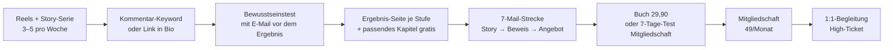
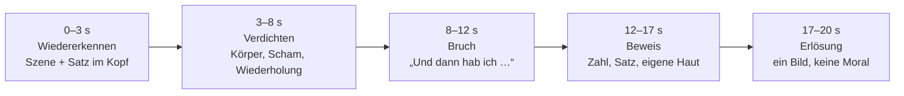

# Kampagnen-Check 2026-09-18 – Befund, Rezept und Kampagne

Stand: 18.09.2026 · Analyse und Kampagnenplan (Claude, im Auftrag von Heiko Schwaninger). Lebendige Fassung: Claude-Doc „Marketing-Kampagnen: Erfolgsfaktoren & Aufbau“, Tab „WMDG: Befund & Kampagne“.

Befund zum Repo `Heiko888/werdemeisterdeinergedanken` (Stand Commit vom 17.09.2026) und daraus abgeleitete Kampagne für „Werde Meister deiner Gedanken“.

## Kurzfazit: Dein Gefühl stimmt – so funktioniert es nicht

Das Projekt ist ein fertiges Produkt mit einem unfertigen Marketing: Es gibt ein ausgereiftes Angebot (7 Stufen, Mitgliederbereich, Buch, 98 Reel-Skripte, 360 Grafikmotive, Stripe, Supabase), aber keine einzige Strecke, die einen fremden Menschen in einen Käufer verwandelt. Drei Kernprobleme erklären fast alles:

1. **Es gibt keinen Verkaufs-Funnel, nur Content.** Der stärkste Lead-Magnet (Bewusstseinstest) sammelt keine E-Mail-Adresse. Die E-Mail-Strecke nach dem E-Book besteht aus sieben Content-Impulsen, deren Links für Nicht-Mitglieder an der Login-Wand enden. Kein Angebot, kein Preis, keine Frist wird per Mail je genannt. Der primäre CTA der Startseite ist ein kostenloses Erstgespräch ohne bepreistes Produkt dahinter.
2. **Es gibt keine Reels, es gibt ein Curriculum in Reel-Länge.** 97 von 97 Skripten sind ungedreht (`src/lib/reels.ts`, alle `filmed: false`). Die Skripte sind Kurskapitel (Stufe 1–7, Vertiefung 1–13) mit Lehrbuch-Sprache („Bewusstsein“, „Bemerken“, „Präsenz“), einem einzigen Format (ruhiger Talking Head, 45 Sekunden), Hooks, die ein Ergebnis versprechen, das der Text nicht liefert, und fünf verschiedenen CTAs ohne Regel. Heiko selbst kommt in keinem Skript mit seiner echten Geschichte vor.
3. **Es gibt keine Vertrauensbasis und keine Messung.** Die drei Testimonials sind nach allem, was im Code steht, Platzhalter; alle Videos (Startseite, 7 Stufen, 29 Vertiefungen, 13 Praxis) zeigen denselben Platzhalter-Clip; der Mitgliedschaftspreis ist als „Platzhalter“ kommentiert. Tracking besteht aus GA4-Seitenaufrufen – kein Pixel, keine Conversion-Events, kein UTM. Es gibt im gesamten Repo keine einzige reale Zahl zu Leads, Verkäufen oder Traffic.

Das Gute daran: Nichts davon ist ein Content- oder Technikproblem. Der Inhalt ist da, der Stack ist da, die Marke ist konsistent. Was fehlt, ist die Verbindung zwischen Aufmerksamkeit und Kauf – und ein Gesicht mit einer Geschichte. Beides lässt sich in 30 Tagen bauen; der Plan steht unten.

## Was vorhanden ist (Stand 17.09.2026)

Das Repo ist ein Next.js-16-Projekt mit 4.274 Dateien; 1,2 GB davon sind generierte Marketing-Grafiken. Die Substanz:

### Angebot und Preisleiter

| Stufe | Produkt | Preis | Mechanik | Beleg |
| --- | --- | --- | --- | --- |
| 0 | Bewusstseinstest (21 Fragen → Stufe 1–7) | 0 EUR | Öffentlich, ohne E-Mail-Eingabe; Ergebnis-CTAs: Kontakt, Mitgliedschaft, E-Book | `src/components/sections/ConsciousnessTest.tsx` |
| 0 | Gratis-E-Book „Die 7 Stufen der Bewusstseinsentwicklung“ (ca. 1.900 Wörter) | 0 EUR | Double-Opt-in via Resend, Leads in Supabase `ebook_leads`, nur E-Mail-Feld | `src/app/api/ebook/route.ts` |
| 0 | Kostenloses Erstgespräch / Klarheitsgespräch | 0 EUR | Kontaktformular + Fragebogen, manuelle Abwicklung, kein Folgeangebot | `src/app/kontakt`, `src/app/klarheitsgespraech` |
| 1 | Buch „Werde Meister deiner Gedanken“ (24 Kapitel, ca. 22.000 Wörter; Thema Reizüberflutung, Framing, Propaganda, Algorithmen) | 29,90 EUR PDF / 39,90 EUR Print | Stripe Einmalkauf, PDF-Lieferung per Webhook | `src/app/buch/page.tsx`, `supabase/migrations/0016_book_orders.sql` |
| 2 | Mitgliedschaft (7 Stufen mit Videos, 14 Übungen, 29 Vertiefungen, 27 Wissenskapitel, Journal, KI-Begleiter, Manipulations-Detektor, 21-Tage-Programm) | 49 EUR/Monat oder 490 EUR/Jahr, kein Trial, keine Garantie | Stripe-Abo; Preis im Code als „Platzhalter“ kommentiert | `src/app/mitgliedschaft/page.tsx:23` |
| – | Workshops (8 Themen, PPTX + Workbook) | kein Preis, keine Buchungsseite | nur Material | `docs/workshop/README.md` |

Zwischen 0 EUR und 49 EUR/Monat liegt nur das Buch. Ein zweites Lead-Magnet-Manuskript („Die Gedanken, die nicht deine sind“, ca. 2.700 Wörter, `docs/ebook/`) ist fertig, aber nicht eingebunden.

### Marke und Zielgruppe

- Persona „Die/der bewusst Suchende“, 25–55, in einer Umbruchphase; Schmerz: Gedankenkreisen, alte Muster, Fremdgesteuertsein (`docs/brandbook/01-marke.md`). Sekundär: skeptische Unternehmer und Projektleiter.
- Claims: „Bewusstseinsentwicklung in 7 Stufen“, „Raus aus fremden Mustern. Rein in dein eigenes Denken.“, „Nicht jeder Gedanke, den du denkst, ist von dir.“
- Tonalität: ruhig, klar, ehrlich, „nicht reißerisch“, Fragen statt Befehle, ein Akzentwort pro Satz (`docs/brandbook/02-tonalitaet.md`).
- Zwei Themenachsen ohne Brücke: Website = innere Arbeit (7 Stufen), Buch = mentale Selbstverteidigung gegen Beeinflussung von außen. 16 von 29 Blogartikeln zur Selbstverteidigung sind deaktiviert.

### Content- und Skript-Fundus

| Material | Umfang | Status |
| --- | --- | --- |
| Reel-Skripte | 97 in 6 Serien (Stufen 21, Praxis 26, Vertiefungen 26, Selbstverteidigung 16, Wissenschaft 7, Teaser 1) | 0 gedreht |
| Langvideo-Drehbücher | 7 Stufen, Praxis, Vertiefungen, Selbstverteidigung, Landing-Intro (3 PDFs im Root) | 0 gedreht |
| Carousels | 55 mit 373 Slides, 5 Funnel-Carousels mit Captions | generiert |
| Cover-Studio | 59 Motive × 5 Formate × 4 Farbwelten | generiert |
| Grafiken | 1.729 PNG in `docs/marketing` (Zitate, Studienfakten, Story-Overlays, WhatsApp, YouTube) | generiert |
| Fotos von Heiko | 22 freigestellte Posen, 6 Bergpanoramen (`tools/social/weisheiten/quellen`) | als Zitatkacheln |
| Redaktionsplan | 26 Wochen, IG 4×/Woche (1 Reel montags 18:00), FB 3×, LinkedIn 3×, YouTube 1× | rein organisch |
| Heikos Geschichte | `docs/buch-1-verwertung/meine-geschichte.md` (1.210 Wörter: Insolvenz 2004, erste Meditation, Verlust von Lena 2020) | nicht live, `/ueber-mich` erzählt nur abstrahiert |
| Story-Titel | 6 Overlays („Der Tag, an dem ich aufhörte zu funktionieren“, „Ich war nie faul – ich war fremdgesteuert“) | ohne Skript |

### Technik

- Tracking: nur GA4 mit Consent-Banner, nur `page_view`; kein Meta-Pixel, keine Conversion-Events, kein UTM-Handling (`src/lib/analytics.ts`, `next.config.ts` CSP erlaubt nur Google).
- E-Mail: Resend transaktional; wöchentlicher Impuls-Cron (montags 07:00) laut Audit vom 16.09. noch nicht produktiv.
- Social-Links: Instagram, YouTube, Facebook, LinkedIn in `src/lib/site.ts`; Telegram TODO, WhatsApp-Kanal ohne Link.
- Videos: Startseiten-Videobotschaft und alle Mitglieder-Videos zeigen einen Platzhalter-Clip (`src/lib/site.ts:26`, `docs/audit/launch-check-2026-09-09.md`).

## Die zehn Schwächen des aktuellen Funnels

| # | Schwäche | Beleg | Folge für eine Kampagne |
| --- | --- | --- | --- |
| 1 | Keine Verkaufsstrecke per E-Mail: 7 Content-Impulse, endlos rotierend, jeder CTA zeigt auf `/mitglieder/stufe/N` und endet für Leads an der Login-Wand | `src/lib/impulses.ts:33ff`, `src/proxy.ts` | Leads werden gewonnen und dann nie ein Angebot gemacht |
| 2 | Falscher Primär-CTA: Startseite und Final-CTA führen zum kostenlosen Erstgespräch, hinter dem kein bepreistes Angebot steht | `src/components/sections/Hero.tsx`, `FinalCta` | Nicht skalierbar; Ads würden Gesprächsanfragen erzeugen, keine Umsätze |
| 3 | Kein Social Proof: 3 Testimonials ohne Herkunft (mutmaßlich Platzhalter), Buch-Stimmen leer, keine Zahlen, keine Qualifikation | `src/lib/content.ts:199–224` | Kalter Traffic hat keinen Grund zu vertrauen |
| 4 | Kein Conversion-Tracking, kein Pixel, kein UTM | `src/lib/analytics.ts` | Jede Anzeige wäre blind; keine Optimierung möglich |
| 5 | Preisleiter mit Loch: 0 → 29,90 → 49/Monat ohne Trial oder Garantie; Mitgliedschaftspreis „Platzhalter“; kein High-Ticket | `src/app/mitgliedschaft/page.tsx:23` | Der Sprung von Gratis zu Abo ist für Fremde zu groß |
| 6 | Video-Versprechen ohne Video: „geführte Videos“ als Kernfeature, aber alle Videos sind ein Platzhalter-Clip | `docs/audit/launch-check-2026-09-09.md` B2/B3 | Wer kauft, wird enttäuscht; wer prüft, kauft nicht |
| 7 | Bewusstseinstest ohne E-Mail-Capture und ohne Segmentierung nach Stufe | `ConsciousnessTest.tsx` (kein `email`-Feld) | Der beste Lead-Magnet bleibt anonym |
| 8 | Zwei Positionierungen ohne Brücke: 7 Stufen (Website) vs. mentale Selbstverteidigung (Buch); differenzierende Blogartikel deaktiviert | `docs/audit/launch-check` W5 | Der schärfste Aufhänger („Nicht jeder Gedanke ist von dir“) ist offline |
| 9 | Null Paid-Assets: keine Anzeigentexte, keine navigationsfreie Landingpage, keine Hook-Varianten; Tonalitätsregel „nicht reißerisch“ nicht für Performance übersetzt | `docs/marketing` (kein Treffer zu Ads/CPL) | Kampagne müsste bei null starten |
| 10 | Keine Daten, kein Betrieb: keine Zahl zu Traffic, Leads, Verkäufen; Impuls-Cron nicht produktiv; Kontaktanfragen erst seit 16.09. gespeichert | `docs/audit/system-faehigkeiten-2026-09-16.md` | Jede Entscheidung wäre Vermutung |

Die fünf Assets, auf denen die Kampagne aufbaut: die Content-Tiefe (ein echtes Produkt, keine Attrappe), der Skript-Fundus (Produktion ist der einzige fehlende Schritt), das konsistente Brandsystem (Creatives in Stunden ableitbar), der saubere Stack (Stripe, Resend, Supabase – Tracking und Sequenzen sind Aufsatzarbeit) und der Hook „Was, wenn es nicht an dir liegt?“ zusammen mit Heikos belegbarer Geschichte.

## Warum die Reels nicht funktionieren

Die Hooks sind formal fast alle vorhanden und oft gut. Das Problem ist der Rest: Was nach dem Hook kommt, Format, Länge, Sprache und CTA. Bewertung von zehn repräsentativen Skripten aus `docs/skripte/reels/`:

| Skript | Hook (wörtlich) | Prognose | Warum |
| --- | --- | --- | --- |
| Teaser „Nicht deine Schuld“ | „Was, wenn dein Problem nie zu wenig Disziplin war?“ | funktioniert | Schmerz, Entlastung, Neugierlücke, einziges Skript mit 3 Hook-Varianten, klarer Funnel (Test) |
| Stufe 1A Autopilot | „Ich hab mal einen Tag lang mitgezählt, wie oft ich wirklich entscheide.“ | nur mit Zahl | Hook verspricht ein Zählergebnis, Skript liefert „ernüchternd“ |
| Stufe 2B | „Wenn du deine Gedanken hören kannst – wer hört dann eigentlich zu?“ | Nische | Philosophisch, komplett abstrakt, kein Alltagsbezug |
| Stufe 3B | „Ein einziges Wort hat mich aus dem Griff eines Gedankens geholt.“ | funktioniert | Konkretes Werkzeug, Vorher/Nachher-Satz – bestes Stufen-Reel |
| Stufe 4B | „Ich hab mal auf die Uhr geschaut, wie lang ein schweres Gefühl wirklich dauert.“ | nur mit Zahl | Payoff „kürzer, als ich dachte“ statt „90 Sekunden“ (die Zahl steht in `vertiefungen.md` 9B) |
| Stufe 6A | „Ich war ständig müde, und keiner konnte mir sagen, warum.“ | riskant | Starker Hook, schwammige Auflösung („Kopf und Herz ziehen nicht am gleichen Strang“) |
| Wissenschaft 06 | „Fast die Hälfte deines Tages bist du gedanklich woanders.“ | als Fakten-Reel | Zahl + Betroffenheit; als Talking Head zu lehrbuchhaft |
| Wissenschaft 01 | „Dein Gehirn trifft manche Entscheidungen, bevor du sie merkst.“ | nicht | Relativiert sich selbst („Deutung umstritten“) – redlich, aber ohne Payoff |
| Selbstverteidigung 02 Framing | „Diese zwei Sätze meinen dasselbe – und fühlen sich völlig anders an.“ | funktioniert | Sofortiger Beweis im Skript; die schärfste Serie, aber ohne Ich-Perspektive |
| Praxis 1A Atembeobachtung | „Setz dich für die nächsten zwei Minuten einfach hin – ich mach mit dir mit.“ | nicht | Kein Hook, sondern eine Aufforderung; Meditationsanleitung gegen Scroll-Verhalten |

### Die sieben Gründe

1. **Curriculum statt Reels.** 97 Skripte sind Kurskapitel in Reel-Länge („Folge für die nächste Stufe“). Social belohnt in sich geschlossene Aha-Momente, keine Lehrpläne.
2. **Kein Gesicht, keine Geschichte.** Heiko existiert nur als 22 Standfotos auf Bergpanoramen. Die „ich“-Momente sind laut Skript selbst austauschbar („nichts Biografisches ist erfunden … setz eine echte Situation ein“). Die echte Geschichte (2004, 2020) kommt nirgends vor.
3. **Hooks versprechen, Payoffs liefern nicht.** „Ich hab mitgezählt“ ohne Zahl, „auf die Uhr geschaut“ ohne Sekunden.
4. **Lehrbuch-Sprache.** „Bewusstsein“ in fast jedem Reel, „Präsenz ist kein Luxus“, „Vom Beobachter zum Gestalter“. Keine Sonntagabend-, Chef-, Partner- oder 3-Uhr-nachts-Szene.
5. **Ein Format, 45 Sekunden, kein Schnitt.** 90–115 Wörter ruhiger Talking Head ohne Pattern Interrupt verliert nach 8–12 Sekunden. Praxis-Variante A (13 Reels) ist ein Anti-Reel.
6. **CTA-Wildwuchs.** Folgen, E-Book, Test, Blog, Mitgliederbereich, Kommentar – fünf Ziele ohne Regel, kein Kommentar-Keyword, keine Landingpage pro Serie.
7. **Produktion auf Print gebaut.** Cover-Studio, PPTX-Overlays, PNG-Kacheln – alles für Statik; kein Schnitt-Template, keine Untertitel, keine Audio-Entscheidung, 1 Reel pro Woche im Plan.

Was fehlt, in einem Satz: eine Person mit einer Geschichte, die in 20 Sekunden einen konkreten Schmerz benennt, einen überraschenden Beweis liefert und immer zum selben nächsten Schritt führt.

## Die neue Kampagnen-Architektur

Ein Funnel, ein Einstieg, ein nächster Schritt pro Stufe. Alles, was heute existiert, bleibt – es wird nur verbunden.

### Positionierung: eine Brücke statt zwei Achsen

Die beiden Themen (innere Muster vs. Beeinflussung von außen) gehören zusammen, wenn man sie als eine Aussage formuliert: **„Nicht jeder Gedanke, den du denkst, ist von dir – und du kannst lernen, das zu bemerken.“** Der äußere Teil (Framing, Algorithmen, Werbung) liefert die schärfsten, teilbarsten Hooks und damit Reichweite; der innere Teil (7 Stufen) liefert das Produkt. Die 16 deaktivierten Selbstverteidigungs-Artikel werden reaktiviert, weil sie der Reichweitenmotor sind.

Get–Who–To–By für die Kampagne: **Get** Menschen zwischen 30 und 55, die abends im Bett Gedankenschleifen drehen und sich selbst dafür verurteilen, **to** in den nächsten 60 Sekunden den Bewusstseinstest zu machen, **by** ihnen zu zeigen, dass das Problem nie Disziplin war, sondern ein Programm – das man sehen und deshalb ändern kann.

### CTA-Regel (gilt für jedes Reel, jede Mail, jede Seite)

| Stufe | Ziel | Einziger CTA |
| --- | --- | --- |
| Reels, Carousels, Stories | Fremde → Test | „Schreib TEST in die Kommentare, ich schick dir den Link“ (Instagram/TikTok) bzw. Link in Bio |
| Test-Ergebnisseite | Lead → Leser | Gratis-Kapitel der eigenen Stufe per Mail (E-Mail wird VOR dem Ergebnis abgefragt) |
| E-Mail 1–4 | Leser → Vertrauen | Antworten auf die Mail („Welcher Satz hat dich getroffen?“) |
| E-Mail 5–7 | Vertrauen → Kauf | Buch oder 7-Tage-Test der Mitgliedschaft – nie beides in einer Mail |
| Startseite | Alles | Hero-CTA = Test; Erstgespräch wandert ans Ende und nur für Mitglieder/Käufer |

### Preisleiter schließen

| Stufe | Angebot | Preis | Zweck |
| --- | --- | --- | --- |
| 0 | Bewusstseinstest + Gratis-Kapitel der eigenen Stufe | 0 EUR | E-Mail + Segmentierung nach Stufe |
| 1 | Buch (PDF/Print) | 29,90 / 39,90 EUR | Erster Kauf, Vertrauen; Käufer bekommen automatisch die Mitgliedschafts-Einladung |
| 2 | Mitgliedschaft mit 7-Tage-Test für 1 EUR oder 14-Tage-Geld-zurück | 49 EUR/Monat, 490 EUR/Jahr | Kernprodukt; Risiko für den Käufer auf null |
| 3 | 21-Tage-Programm als Einzelkauf (existiert bereits im Mitgliederbereich) | 97–147 EUR | Einstieg für Abo-Skeptiker, führt in die Mitgliedschaft |
| 4 | 1:1-Begleitung, 8 Wochen (aus dem Erstgespräch) | 990–1.990 EUR | Das Erstgespräch bekommt endlich ein Ziel |

Die Zahlen für Stufe 3 und 4 sind Vorschläge, keine Marktdaten; sie orientieren sich an vergleichbaren deutschsprachigen Persönlichkeitsentwicklungs-Angeboten und müssen mit den ersten 20 Verkäufen geprüft werden.

### Verkaufsstrecke per E-Mail (ersetzt die Impuls-Rotation für Leads)

| Tag | Mail | Inhalt | CTA |
| --- | --- | --- | --- |
| 0 | Dein Ergebnis: Stufe N | Ergebnis, was es bedeutet, Gratis-Kapitel als Link (kein Login) | Kapitel lesen |
| 1 | Was, wenn es nie an dir lag? | Heikos Geschichte Teil 1: 2004, der Gerichtsvollzieher, der erste Gedanke „ich bin gescheitert“ – und wer ihn eigentlich gedacht hat | Antworten |
| 3 | Der Satz, der alles einfärbt | Kernüberzeugungen erklärt am eigenen Beispiel; eine 2-Minuten-Übung | Übung machen |
| 5 | 90 Sekunden | Wie lange ein Gefühl wirklich dauert (Studie) und warum Grübeln es verlängert | Antworten: „Welcher Gedanke hält dich nachts wach?“ |
| 7 | Das Buch | Warum ich es geschrieben habe; drei Kapitelüberschriften; Leseprobe | Buch kaufen (29,90) |
| 9 | Was im Mitgliederbereich passiert | Rundgang in Screenshots/Video: Stufe 1 Übung, Journal, KI-Begleiter; ehrlich: für wen es nichts ist | 7-Tage-Test starten |
| 11 | Letzte Mail dieser Reihe | Zusammenfassung, Antwort auf die drei häufigsten Einwände (Zeit, Esoterik-Verdacht, „hab schon alles probiert“) | Test starten, danach wöchentliche Impulse |

Danach übernimmt die bestehende Impuls-Rotation – aber mit Links, die für Nicht-Mitglieder auf öffentliche Seiten zeigen. Buch-Käufer bekommen eine eigene 3-Mail-Strecke (Tag 3, 10, 21) mit Einladung in die Mitgliedschaft.

### Social Proof aufbauen, bevor Geld in Reichweite fließt

- Die drei Testimonials entfernen oder durch echte ersetzen. Weg: 10 Menschen aus dem Umfeld bekommen 30 Tage Gratis-Zugang gegen eine ehrliche Sprachnachricht oder drei Sätze. Namen mit Einverständnis, Beruf, Stufe im Test.
- Zahlen, die sofort verfügbar sind: „27 Kapitel Wissensdatenbank“, „29 Vertiefungen“, „14 Übungen“, „21-Tage-Programm“, später „X Menschen haben den Test gemacht“ (Zähler aus Supabase).
- Heikos Qualifikation ist seine Geschichte, nicht ein Titel: 2004 Insolvenz, 20 Jahre Praxis, 2020 der Verlust – und dass er trotzdem hier ist. Das gehört auf die Startseite, nicht in ein Archiv.

## Reels neu aufgesetzt

Drei Serien statt sechs Curricula, drei Formate statt einem, 20 Sekunden statt 45, ein CTA statt fünf. Der Skript-Fundus bleibt die Quelle – er wird umgeschnitten, nicht weggeworfen.

### Formatsystem

| Format | Anteil | Aufbau | Länge | Produktion |
| --- | --- | --- | --- | --- |
| A: Talking Head mit Szene | 50 % | Hook als eingebrannter Text (0–1 s) → Alltagsszene (2–8 s) → Wendung (8–15 s) → Payoff mit Zahl oder Satz (15–20 s); alle 3–5 s ein Schnitt, Zoom oder Textwechsel; Untertitel immer | 18–25 s, 50–70 Wörter | Handy, Fenster-Licht, Lavalier-Mikro, CapCut; 5 Reels pro Drehstunde |
| B: Green Screen „Beweis“ | 30 % | Heiko vor Schlagzeile, Screenshot, Werbeanzeige oder Satzpaar; zeigt und kommentiert | 15–25 s | Green-Screen-Effekt in CapCut/Instagram, Screenshot als Hintergrund |
| C: Text-first Fakt | 20 % | Zahl groß im Bild (3 Textkarten mit Kick-Schnitt), Quelle klein, Voice-over oder Musik | 8–12 s | Aus Cover-Studio und Foliensatz; kein Dreh nötig |

Regeln: Kein Reel ohne konkrete Szene oder Zahl. Kein „Bewusstsein“, „Präsenz“, „Stufe“ im gesprochenen Text der ersten 10 Sekunden. Der Hook verspricht nur, was das Reel liefert. CTA nie im Video, nur in Caption und als angepinnter Kommentar: „Schreib TEST – ich schick dir den Link zum kostenlosen Bewusstseinstest.“ Serien-Nummer im Cover („#3“), Cliffhanger-Satz zur nächsten Folge in der Caption.

### Drei Serien

| Serie | Format | Zweck | Quelle im Repo |
| --- | --- | --- | --- |
| **„Wessen Gedanke ist das?“** (Reichweite) | B + C | Framing, Etiketten, Feed, Werbung, Wiederholung – die schärfsten, teilbarsten Hooks | `mentale-selbstverteidigung.md` 2, 3, 5, 6, 10; `wissenschaft.md` 06, 03 |
| **„Ich war nie faul“** (Vertrauen) | A | Heikos Geschichte in sechs Folgen: 2004, der erste Gedanke, die erste Meditation, 2020, was blieb, warum die 7 Stufen | `story-overlays.mjs` (6 Titel), `meine-geschichte.md` |
| **„Der Satz, der dich festhält“** (Werkzeug) | A | Ein Gedankenmuster, ein Werkzeug, ein Vorher/Nachher-Satz pro Folge | `stufen.md` 3B, 1A, 4B; `vertiefungen.md` 9B, Innerer Kritiker, Grübeln |

Rhythmus: 4 Reels pro Woche in den ersten 8 Wochen (2 Reichweite, 1 Vertrauen, 1 Werkzeug), danach 3. Alles zuerst auf Instagram und TikTok, YouTube Shorts als Zweitverwertung.

### Zehn fertige Skripte (drehfertig)

**1 · Wessen Gedanke #1 · Format B · 20 s** Hook (Text): *Diese zwei Sätze meinen dasselbe.* – Heiko vor zwei Schlagzeilen: „Der Staat investiert zehn Milliarden“ / „Der Staat gibt zehn Milliarden aus“. „Gleiche Zahl. Aber lies mal, was du fühlst. Investiert klingt nach Zukunft. Gibt aus klingt nach Verschwendung. Das Wort hat entschieden, bevor du gedacht hast. Und das passiert dir hundertmal am Tag – in Nachrichten, in Meetings, in deinem eigenen Kopf.“ Endkarte: *Reagierst du auf die Sache – oder auf das Wort?* Caption-CTA: TEST.

**2 · Wessen Gedanke #2 · Format C · 10 s** Karte 1: *47 %*. Karte 2: *So viel deiner Wachzeit bist du gedanklich woanders.* Karte 3: *Und genau in diesen Minuten warst du am unglücklichsten – egal, was du gerade getan hast.* Quelle klein: Killingsworth & Gilbert, Science 2010. Caption: „Nicht das Leben macht unglücklich. Das Abschweifen. Schreib TEST, wenn du wissen willst, wie viel deines Tages dir gehört.“

**3 · Wessen Gedanke #3 · Format B · 20 s** Hook: *Werbung verkauft dir kein Produkt.* – Heiko vor einer Beauty- oder Fitness-Anzeige. „Sie verkauft dir einen Mangel. Erst das Gefühl, dass etwas fehlt – dann das Ding, das es angeblich füllt. Schau dir die Anzeige nochmal an: Was soll dir gerade fehlen? Und hat es dir gefehlt, bevor du sie gesehen hast?“

**4 · Wessen Gedanke #4 · Format B · 20 s** Hook: *Du siehst online nicht die Welt.* – Heiko vor seinem eigenen Feed. „Du siehst dich selbst – verstärkt. Jeder Klick sagt dem Algorithmus: mehr davon. Nach drei Wochen zeigt er dir eine Welt, die nur aus deinen Reaktionen besteht. Und du hältst sie für die Realität. Der Test: Scroll heute mal durch den Feed von jemandem, den du magst und der anders tickt.“

**5 · Ich war nie faul #1 · Format A · 25 s** Hook: *2004 stand der Gerichtsvollzieher vor meiner Tür.* – „Die Firma, für die ich arbeitete, ging unter. Mein Mieter zahlte nicht. Die gelben Briefe stapelten sich. Und der Gedanke, der in dieser Zeit lief, war immer derselbe: Du hast versagt. Ich hab ihn geglaubt. Jahrelang. Bis mir jemand eine Frage stellte, die ich mir nie gestellt hatte: Wessen Stimme ist das eigentlich? Die Antwort hat alles verändert. Erzähl ich dir in Folge 2.“

**6 · Ich war nie faul #2 · Format A · 25 s** Hook: *Meine erste Meditation war ein Desaster.* – „Kaum Augen zu: Jucken am Arm. Am Bein. Auf der Nase. Und dann ging das Karussell los – bin ich auf dem richtigen Weg, was mach ich hier eigentlich. Je mehr ich die Gedanken wegdrücken wollte, desto lauter wurden sie. Irgendwann hab ich aufgegeben. Nicht die Meditation – den Kampf. Okay, dann seid ihr halt da. Und in dem Moment wurde es zum ersten Mal still. Nicht weil die Gedanken weg waren. Weil ich aufgehört hatte, jedem zu glauben.“

**7 · Ich war nie faul #3 · Format A · 25 s** (nur mit Heikos ausdrücklichem Ja; siehe offene Entscheidungen) Hook: *Ein Samstag im Juli 2020, 16 Uhr, mein Handy klingelt.* – „Ich stand zwischen Supermarktregalen, Aushilfsjob, alles andere war im Lockdown weggebrochen. Es war Lenas Schwester. Und ich wusste es, bevor sie etwas sagte. Lena hatte sich das Leben genommen. Ich erzähl das nicht, weil es eine Technik gibt, die so etwas wegmacht. Es gibt keine. Ich erzähl es, weil ich in diesem Moment nur eins hatte: den Atem, den ich 16 Jahre vorher gelernt hatte. Er hat nichts geheilt. Aber er hat mich zum Auto gebracht.“ Caption mit Hinweis auf die Telefonseelsorge 0800 111 0 111.

**8 · Der Satz #1 · Format A · 20 s** Hook: *Ein einziges Wort hat mich aus dem Griff eines Gedankens geholt.* – „‚Ich bin ein Versager.‘ Den Satz kannte ich gut. Er fühlt sich nicht an wie ein Gedanke – er fühlt sich an wie die Wahrheit. Dann hab ich gelernt, ihn umzubauen: ‚Ich bemerke den Gedanken, dass ich ein Versager sei.‘ Hör auf den Unterschied. Plötzlich ist der Satz ein Ding in meinem Kopf. Nicht mehr die Brille, durch die ich schaue.“ Endkarte: *Ich bin … → Ich bemerke den Gedanken, dass …*

**9 · Der Satz #2 · Format A · 20 s** Hook: *Ein Gefühl dauert 90 Sekunden. Wenn du es nicht fütterst.* – „Ich hab mal auf die Uhr geschaut. Wut, Angst, Scham – die erste Welle steigt, kippt, sinkt. Anderthalb Minuten. Alles danach ist nicht mehr das Gefühl. Das ist der Gedanke, der es nachlegt: Und weißt du noch, letztes Jahr … Die Regel, die ich seitdem habe: Wenn es heftig wird, 90 Sekunden keine Entscheidung. Erst danach die Frage: Was ist jetzt wirklich dran?“

**10 · Der Satz #3 · Format A · 20 s** Hook: *Ich hab einen Tag lang mitgezählt, wie oft ich wirklich entscheide.* – „Handy vor dem Aufstehen: nicht entschieden. Kaffee, Weg, Antwort auf die Mail vom Chef: nicht entschieden. Am Abend stand da eine Zahl: drei. Drei echte Entscheidungen an einem ganzen Tag. Der Rest lief – wie ein Programm, das ich nie geschrieben hab. Der Autopilot ist nicht dein Feind. Aber er ist auch nicht du. Und bemerken kommt vor ändern.“ (Die Zahl muss Heikos echte sein – einen Tag zählen, bevor gedreht wird.)

Jedes Skript hat drei Hook-Varianten, die als drei getrennte Reels mit identischem Body gedreht werden; nach zwei Wochen gewinnt die Variante mit der besten 3-Sekunden-Haltequote. Messgrößen pro Reel: 3-s-Haltequote (Ziel über 60 %), Durchschauquote (Ziel über 40 %), Saves und Shares pro 1.000 Views, Follows pro 1.000 Views, TEST-Kommentare.

## Emotionale Aufladung: Warum die Skripte flach wirken – und das Rezept dagegen

Die vorhandenen Skripte erklären Gefühle, statt sie auszulösen. „Ein Gedankenkarussell setzte sich in Bewegung“ ist eine Beschreibung; „3 Uhr nachts, die Decke, und der eine Satz, der nicht aufhört“ ist ein Erlebnis. Die Zuschauerin muss in den ersten fünf Sekunden etwas in sich wiedererkennen – nicht verstehen, wiedererkennen. Das ist die Mechanik hinter Dove, Always, Edeka und Plickats Uhren-Beispiel: Emotion entsteht nie durch das Wort „Gefühl“, sondern durch ein konkretes Bild, in dem der Zuschauer sich selbst sieht.

### Die sieben Hebel (Checkliste für jedes Skript)

| Hebel | Was es heißt | Flach (aus den Skripten) | Aufgeladen |
| --- | --- | --- | --- |
| 1 Szene statt Begriff | Ort, Uhrzeit, Gegenstand, eine Person | „Im Alltag denken wir oft …“ | „Sonntag, 22:40, du liegst im Bett, morgen Montag, und dein Kopf spielt das Gespräch von Freitag zum vierten Mal ab.“ |
| 2 Körper vor Kopf | Wo sitzt das Gefühl? Was macht der Körper? | „Das erzeugt Stress“ | „Der Magen zieht sich zusammen, bevor du weißt, warum.“ |
| 3 Der Satz im Kopf, wörtlich | Den inneren Gedanken zitieren, nicht beschreiben | „Selbstzweifel melden sich“ | „‚Die anderen kriegen das hin. Nur du nicht.‘“ |
| 4 Die Wendung als Entlastung | Nicht „du solltest“, sondern „es war nie deine Schuld“ | „Achte auf deine Muster“ | „Dieser Satz ist nicht von dir. Du hast ihn mit acht gelernt.“ |
| 5 Ein Zahl oder ein Beweis | Etwas, das man überprüfen kann | „kürzer, als ich dachte“ | „90 Sekunden. Ich hab die Uhr laufen lassen.“ |
| 6 Eigene Haut | Heiko hat es selbst erlebt, mit Datum | „Ich hab mal …“ (austauschbar) | „2004, der Gerichtsvollzieher, und der Satz ‚du hast versagt‘ – ich hab ihn sechs Jahre geglaubt.“ |
| 7 Erlösung, kein Lehrsatz | Das letzte Bild ist ein Gefühl, keine Moral | „Präsenz ist kein Luxus.“ | „Und zum ersten Mal war es still. Nicht weil die Gedanken weg waren. Weil ich aufgehört hab, jedem zu glauben.“ |

Regel: Mindestens vier der sieben Hebel pro Reel, Hebel 1 und 3 immer. Und ein Wort-Verbot für die ersten zehn Sekunden: Bewusstsein, Präsenz, Achtsamkeit, Stufe, Muster, Autopilot, Programm – alles Begriffe, die erklären statt zeigen. Sie dürfen am Ende kommen, wenn die Zuschauerin schon fühlt, wovon die Rede ist.

### Der emotionale Bogen in 20 Sekunden

Die Spannung entsteht zwischen B und C: Erst muss es kurz weh tun (die Zuschauerin denkt „das bin ich“), dann kommt die Entlastung („es liegt nicht an dir“). Ohne B ist C wertlos – das ist der häufigste Fehler in den vorhandenen Skripten: Sie springen direkt zur Lösung.

### Die zehn Skripte, emotional neu geschrieben

**1 · Wessen Gedanke #1 · Framing · Format B** *Hook (Text):* Zwei Sätze. Gleiche Zahl. Und dein Bauch entscheidet anders. „Lies mal: ‚Der Staat investiert zehn Milliarden.‘ Merkst du, wie sich dein Kopf leicht hebt? Jetzt: ‚Der Staat gibt zehn Milliarden aus.‘ Da. Der kleine Ärger. Gleiche Zahl – aber jemand hat das Wort für dich ausgesucht. Und mit dem Wort dein Gefühl. Das passiert dir heute noch fünfzigmal. In den Nachrichten. Im Meeting. Und am härtesten: in deinem eigenen Kopf, wenn du dich ‚faul‘ nennst statt ‚erschöpft‘.“ *Endkarte:* Wer hat das Wort ausgesucht?

**2 · Wessen Gedanke #2 · 47 % · Format C** Karte 1: *47 %.* Karte 2: *So viel deines Tages bist du nicht da, wo du bist.* Karte 3: *Beim Abendessen mit den Kindern – im Kopf noch im Meeting. Und genau da warst du am unglücklichsten.* Karte 4: *Nicht dein Leben macht dich müde. Das Woanders-Sein.* Quelle klein: Killingsworth & Gilbert, Science 2010.

**3 · Wessen Gedanke #3 · Werbung · Format B** *Hook:* Vor dieser Anzeige hat dir nichts gefehlt. „Schau sie dir an. Zehn Sekunden vorher warst du okay. Jetzt ist da dieses leise Ziehen: zu alt, zu weich, zu wenig. Das ist kein Zufall. Das ist der Job der Anzeige. Erst den Mangel, dann das Ding, das ihn angeblich füllt. Ich hab jahrelang gedacht, das Ziehen wäre meins. Es war gemietet. Frag beim nächsten Mal: Hat mir das gefehlt, bevor ich es gesehen hab?“

**4 · Wessen Gedanke #4 · Feed · Format B** *Hook:* Dein Feed zeigt dir nicht die Welt. Er zeigt dir deine schlechteste Woche. „Du hattest einen miesen Tag und hast dreimal bei ‚alles wird schlimmer‘ hängen geblieben. Der Algorithmus hat sich das gemerkt. Seitdem kriegst du mehr davon. Nach drei Wochen sieht die Welt aus wie dein schlechtester Tag – und du hältst das für Realität. Das ist nicht deine Wahrnehmung. Das ist eine Kopie deiner Klicks. Mach heute Abend eins: Scroll durch den Feed von jemandem, den du magst und der anders tickt. Und spür, wie anders die Welt aussieht.“

**5 · Ich war nie faul #1 · 2004 · Format A** *Hook:* 2004. Der Gerichtsvollzieher klingelt, und ich stelle mich tot. „Ich stand hinter der Tür und hab den Atem angehalten. Die Firma war am Ende, der Mieter zahlte nicht, die gelben Briefe lagen ungelesen auf dem Küchentisch, weil ich sie nicht mehr aufmachen konnte. Und im Kopf lief ein Satz, immer derselbe: ‚Du hast versagt.‘ Nicht laut. Ganz ruhig. Wie eine Tatsache. Ich hab ihn geglaubt. Sechs Jahre lang. Bis mir jemand eine Frage gestellt hat, die ich mir nie gestellt hatte: ‚Wessen Stimme ist das eigentlich?‘ Die Antwort erzähl ich dir in Folge 2. Sie hat mich mehr erschrocken als der Gerichtsvollzieher.“

**6 · Ich war nie faul #2 · Erste Meditation · Format A** *Hook:* Meine erste Meditation: zehn Minuten, und ich wollte schreien. „Augen zu. Sofort: Jucken am Arm. Am Bein. Auf der Nase. Und dann ging es los – ‚Was machst du hier, du hast Schulden, du solltest arbeiten, bist du jetzt so einer?‘ Je fester ich die Gedanken wegdrücken wollte, desto lauter wurden sie. Ich hab gekämpft wie gegen Wasser. Irgendwann hab ich aufgegeben. Nicht die Meditation – den Kampf. ‚Okay. Dann seid ihr halt da.‘ Und dann ist etwas passiert, was ich nicht erwartet hatte: Es wurde still. Nicht, weil die Gedanken weg waren. Weil ich zum ersten Mal nicht jedem geglaubt hab.“

**7 · Ich war nie faul #3 · Juli 2020 · Format A** (nur mit Heikos Ja) *Hook:* Samstag, 16 Uhr, zwischen Supermarktregalen. Mein Handy klingelt. „Lockdown. Alle Aufträge weg, ich räumte Regale ein, um die Miete zu zahlen. Auf dem Display: Lenas Schwester. Und mein Magen wusste es, bevor sie ein Wort gesagt hat. Lena hatte sich das Leben genommen. Das Piepen der Kassen, das Murmeln der Kunden – alles wie durch eine Wand aus Watte. Ich erzähl dir das nicht, weil ich eine Technik hätte, die so etwas wegmacht. Die gibt es nicht. Ich erzähl es, weil ich in diesem Moment genau eine Sache hatte: den Atem, den ich sechzehn Jahre vorher zwischen gelben Briefen gelernt hatte. Er hat nichts geheilt. Aber er hat mich bis zum Auto gebracht.“ *Caption:* Telefonseelsorge 0800 111 0 111, rund um die Uhr, kostenlos.

**8 · Der Satz #1 · Defusion · Format A** *Hook:* ‚Ich bin ein Versager.‘ Der Satz fühlt sich nicht an wie ein Gedanke. „Er fühlt sich an wie die Wahrheit. Wie etwas, das man mir nur noch nicht gesagt hat. Ich kannte ihn seit 2004. Dann hat mir jemand gezeigt, ihn umzubauen. Ein Wort dazwischen: ‚Ich bemerke den Gedanken, dass ich ein Versager sei.‘ Sag ihn mal laut. Hörst du das? Plötzlich ist der Satz ein Ding in meinem Kopf. Ich kann ihn anschauen. Er ist nicht mehr die Brille, durch die ich alles sehe. Das Wort heißt ‚bemerken‘. Es ist das erste, das ich je gegen diesen Satz hatte.“ *Endkarte:* Ich bin … → Ich bemerke den Gedanken, dass …

**9 · Der Satz #2 · 90 Sekunden · Format A** *Hook:* Wut dauert 90 Sekunden. Alles danach ist eine Geschichte, die du dir erzählst. „Ich hab die Uhr laufen lassen. Die Nachricht kommt, der Hals wird eng, das Herz schlägt bis in die Ohren – und dann: Es kippt. Anderthalb Minuten. Der Körper ist fertig. Aber der Kopf legt nach: ‚Und letztes Jahr, und schon wieder, und typisch.‘ Das ist nicht mehr die Wut. Das ist der Gedanke, der sie füttert. Meine Regel seitdem: Wenn es heftig wird, 90 Sekunden nichts entscheiden. Nichts schreiben. Erst wenn die Welle unten ist, die eine Frage: Was ist jetzt wirklich dran?“

**10 · Der Satz #3 · Drei Entscheidungen · Format A** *Hook:* Ich hab einen Tag lang gezählt, wie oft ich wirklich entscheide. Drei. „Handy vorm Aufstehen – nicht entschieden, die Hand war schneller. Kaffee, gleicher Weg, dieselbe Antwort auf die Mail vom Chef, dieselbe Serie abends. Um 22 Uhr stand da eine Zahl, und mir wurde kalt: drei. Drei echte Entscheidungen an einem ganzen Tag. Der Rest lief wie ein Programm, das ich nie geschrieben hab. Und das Schlimmste war nicht die Zahl. Es war, dass sich der Tag angefühlt hatte wie meiner. Der Autopilot ist nicht dein Feind. Aber er ist nicht du. Und bemerken kommt vor ändern.“ (Die Zahl muss Heikos echte sein.)

### So werden die übrigen 87 Skripte umgeschrieben

1. Hook lesen: Verspricht er eine Szene, eine Zahl oder eine Erlösung? Wenn nur ein Begriff – neu schreiben.
2. Ersten Satz nach dem Hook durch eine Szene mit Uhrzeit und Gegenstand ersetzen (Hebel 1).
3. Den inneren Satz wörtlich einbauen, in Anführungszeichen (Hebel 3).
4. Die Lösung um zwei Sätze nach hinten schieben; davor muss es kurz weh tun (Bogen B).
5. Den Beweis prüfen: Zahl, Datum oder Satzpaar – sonst aus `wissenschaft.md` oder `meine-geschichte.md` holen.
6. Den letzten Satz streichen, wenn er eine Moral ist, und durch ein Bild ersetzen.
7. Auf 60–75 Wörter kürzen; alles, was erklärt, fliegt zuerst.

Die Stufen-Serie ist komplett umgeschrieben: [Reels: 7 Stufen (neu)](file/ea4f9a07-18e9). Vertiefungen und Selbstverteidigung: [Reels: Vertiefungen & Selbstverteidigung (neu)](file/a1e18221-1791)

## 30-Tage-Plan

Reihenfolge ist entscheidend: erst der Funnel, dann die Reels, dann Reichweite. Wer Reels vor dem Funnel postet, verschenkt jede Aufmerksamkeit.

| Tage | Block | Aufgaben | Ergebnis |
| --- | --- | --- | --- |
| 1–5 | Funnel-Fix im Code | Test fragt E-Mail vor dem Ergebnis ab und schreibt Stufe in `ebook_leads`; Ergebnis-Seite je Stufe mit Gratis-Kapitel; Impuls-Links für Nicht-Mitglieder auf öffentliche Seiten; 7-Mail-Verkaufsstrecke in `impulses.ts`-Logik; Hero-CTA → Test; Conversion-Events (lead, test\_complete, checkout, purchase) in GA4; Meta-Pixel + UTM-Speicherung | Ein Fremder kann vom Test bis zum Kauf durchlaufen, und jeder Schritt ist messbar |
| 3–7 | Vertrauen | Platzhalter-Testimonials raus; 10 Beta-Nutzer einladen (30 Tage gratis gegen Feedback); Heikos Geschichte auf `/ueber-mich` (Teil 1–3 aus `meine-geschichte.md`); Startseiten-Videobotschaft drehen (Landing-Intro-Drehbuch existiert, 2 Min.) | Echte Stimmen bis Tag 30; ein Gesicht auf der Startseite |
| 5–7 | Angebot | Mitgliedschaftspreis final entscheiden; 7-Tage-Test oder 14-Tage-Garantie in Stripe; 21-Tage-Programm als Einzelprodukt anlegen; Erstgespräch mit 1:1-Angebot verknüpfen | Preisleiter ohne Loch |
| 8–10 | Drehtag 1 | 10 Skripte × 3 Hook-Varianten = 30 Reels an einem Tag (Format A und B); Format-C-Reels aus Foliensatz bauen; Untertitel in CapCut; Cover aus Cover-Studio mit Serien-Nummer | 40 fertige Reels für 8 Wochen |
| 11–14 | Soft-Start | 4 Reels pro Woche posten (IG + TikTok, YT Shorts als Zweitverwertung); TEST-Kommentar-Automation (ManyChat oder manuell); Baseline notieren: Follower, Listengröße, Test-Abschlüsse, Verkäufe | Erste Daten nach 7 Tagen |
| 15–21 | Erste Auswertung | After-Action Review pro Reel: 3-s-Haltequote, Durchschauquote, TEST-Kommentare; Gewinner-Hooks identifizieren; Mail-Strecke: Öffnungs- und Klickraten je Mail | Wissen, welche Serie und welcher Hook zieht |
| 22–30 | Skalieren | Die 3 besten Reels mit 10–20 EUR/Tag als Ads auf Test-Landingpage (navigationsfrei, `/test?utm=…`); Retargeting auf Video-Viewer und Test-Abbrecher (KFC-Prinzip); Drehtag 2 mit den Gewinner-Formaten; erste echte Testimonials einbauen | Erste bezahlte Leads mit bekanntem Preis pro Lead |

### Budget für die ersten 30 Tage

| Posten | Betrag | Anmerkung |
| --- | --- | --- |
| Technik (Lavalier-Mikro, Green-Screen-Stoff, Handy-Stativ, Licht) | ca. 150–250 EUR | einmalig |
| CapCut Pro, ManyChat (Kommentar-Automation) | ca. 30–50 EUR/Monat | optional, ManyChat spart Stunden |
| Paid Reach Tage 22–30 | 10–20 EUR/Tag, ca. 150–200 EUR | nur auf Gewinner-Reels, nur mit Tracking |
| Beta-Nutzer | 0 EUR (Gratis-Zugang) | 10 Personen |
| Summe | ca. 400–500 EUR | plus Heikos Zeit: 2 Drehtage, 2 Std. pro Woche Community |

Ziel nach 30 Tagen: 40 Reels veröffentlicht, 200–500 Test-Abschlüsse mit E-Mail, 5–10 echte Testimonials, erste 10–20 Buchverkäufe oder Test-Mitgliedschaften, und für jeden Schritt eine Zahl. Diese Zahlen sind Erwartung, nicht Versprechen – sie hängen von der Startreichweite ab, die im Repo nirgends dokumentiert ist.

## Änderungen am Repo (Change-Liste zur Dokumentation)

Status 18.09.2026: Punkt 14 (Reel-Skripte + `src/lib/reels.ts`) ist umgesetzt, Punkte 1–7 sind im PR `claude/kampagnen-funnel` umgesetzt (Protokoll in `docs/AENDERUNGEN.md`, Eintrag „Funnel-Fixes 1–7“); Rest offen. Jede Zeile wird nach Umsetzung in `docs/AENDERUNGEN.md` und als Audit-Datei `docs/audit/kampagnen-check-<Datum>.md` festgehalten, damit der Serverstand nachvollziehbar bleibt.

| # | Änderung | Dateien | Priorität |
| --- | --- | --- | --- |
| 1 | Bewusstseinstest: E-Mail-Feld vor dem Ergebnis (Double-Opt-in wie E-Book), Stufe in `ebook_leads` speichern (neue Spalte `stufe`, `source = test`) | `src/components/sections/ConsciousnessTest.tsx`, `src/app/api/ebook/route.ts`, neue Migration `supabase/migrations/00xx_leads_stufe.sql` | umgesetzt (PR) |
| 2 | Ergebnis-Seite je Stufe mit Gratis-Kapitel (öffentlich, ohne Login) | `src/app/bewusstseinstest/ergebnis/[stufe]/page.tsx`, Inhalte aus `content/pdf/stufe-N-lektion.pdf` | umgesetzt (PR) |
| 3 | Impuls-Links: für Leads ohne Mitgliedschaft auf öffentliche Seiten statt `/mitglieder/stufe/N` | `src/lib/impulses.ts:33ff`, `src/lib/impulse-mailer.ts` | umgesetzt (PR) |
| 4 | 7-Mail-Verkaufsstrecke nach Test/E-Book (Tag 0–11), danach Impuls-Rotation; 3-Mail-Strecke für Buch-Käufer | neue `src/lib/sequences.ts`, Cron-Logik in `deploy/docker-compose.yml`, Tabelle `lead_sequence_state` | umgesetzt (PR) |
| 5 | Hero-CTA → Test; Erstgespräch ans Seitenende; Final-CTA → Test | `src/components/sections/Hero.tsx`, `FinalCta.tsx` | umgesetzt (PR) |
| 6 | Conversion-Events in GA4 (`lead`, `test_complete`, `begin_checkout`, `purchase`) + Meta-Pixel mit Consent + UTM-Parameter in Lead- und Order-Tabellen speichern | `src/lib/analytics.ts`, `next.config.ts` (CSP für connect.facebook.net), `src/app/api/ebook/route.ts`, Stripe-Metadaten | umgesetzt (PR) |
| 7 | Testimonials: Platzhalter entfernen, `testimonials` leer lassen bis echte vorliegen; Abschnitt blendet sich aus wie bei `bookTestimonials` | `src/lib/content.ts:201–224`, `Testimonials.tsx` | umgesetzt (PR) |
| 8 | Mitgliedschaft: Preis final, 7-Tage-Test (Stripe `trial_period_days`) oder Garantie-Text; 21-Tage-Programm als Einzelprodukt | `src/app/mitgliedschaft/page.tsx`, `src/app/api/checkout/route.ts`, `docs/STRIPE-MITGLIEDSCHAFT.md` | Hoch |
| 9 | `/ueber-mich` mit Heikos Geschichte (Teil 1–3), Telefonseelsorge-Hinweis am Fuß | `src/app/ueber-mich/page.tsx`, Quelle `docs/buch-1-verwertung/meine-geschichte.md` | Hoch |
| 10 | Navigationsfreie Ad-Landingpage `/test` mit Hook-Varianten per Query (\`?h=a | b | c\`) |
| 11 | 16 deaktivierte Selbstverteidigungs-Artikel reaktivieren | `src/lib/blog.ts` | Mittel |
| 12 | Startseiten-Video: echte YouTube-ID eintragen | `src/lib/site.ts:26` | Mittel |
| 13 | Impuls-Cron produktiv starten (laut Audit 16.09. offen) | `deploy/docker-compose.yml`, Server | Mittel |
| 14 | Redaktionsplan auf 4 Reels/Woche und drei Serien umstellen; `src/lib/reels.ts` um Serien-Nummer, Hook-Variante und Messfelder (`hold3s`, `watchThrough`, `testComments`) erweitern | `docs/marketing/redaktionsplan/`, `src/lib/reels.ts` | Mittel |
| 15 | Test-Zähler für Social Proof („X Menschen haben den Test gemacht“) | Supabase-View + `Hero.tsx` | Niedrig |

Wenn du willst, setze ich die Punkte 1–7 direkt im Repo um (Branch `claude/kampagnen-funnel`, Pull Request mit Change-Log) – dann steht der Serverstand in `docs/AENDERUNGEN.md`.

## Offene Entscheidungen für Heiko

- [ ] **Lenas Geschichte öffentlich erzählen? Entschieden am 18.09.2026: Ja, bleibt drin (Reel 7, E-Mail-Strecke, /ueber-mich) – immer mit dem Telefonseelsorge-Hinweis.**
- [ ] **Mitgliedschaftspreis:** 49/490 EUR beibehalten oder auf 29/290 EUR für den Start senken und später erhöhen? Mit 7-Tage-Test für 1 EUR oder 14-Tage-Garantie?
- [ ] **1:1-Angebot:** Willst du Begleitung verkaufen (990–1.990 EUR, 8 Wochen)? Wenn nein, wird das Erstgespräch von der Startseite genommen.
- [ ] **Vor die Kamera:** Zwei Drehtage im ersten Monat, danach ein halber Tag pro Monat. Ohne dein Gesicht funktioniert nur Format C – das reicht für Reichweite, nicht für Vertrauen.
- [ ] **Umsetzung im Repo durch mich:** Punkte 1–7 der Change-Liste als Pull Request?
- [ ] **Startreichweite:** Wie viele Follower auf Instagram/TikTok/YouTube und wie viele Adressen in der Liste gibt es heute? Davon hängt ab, ob Paid Reach ab Tag 22 oder erst ab Tag 45 sinnvoll ist.
