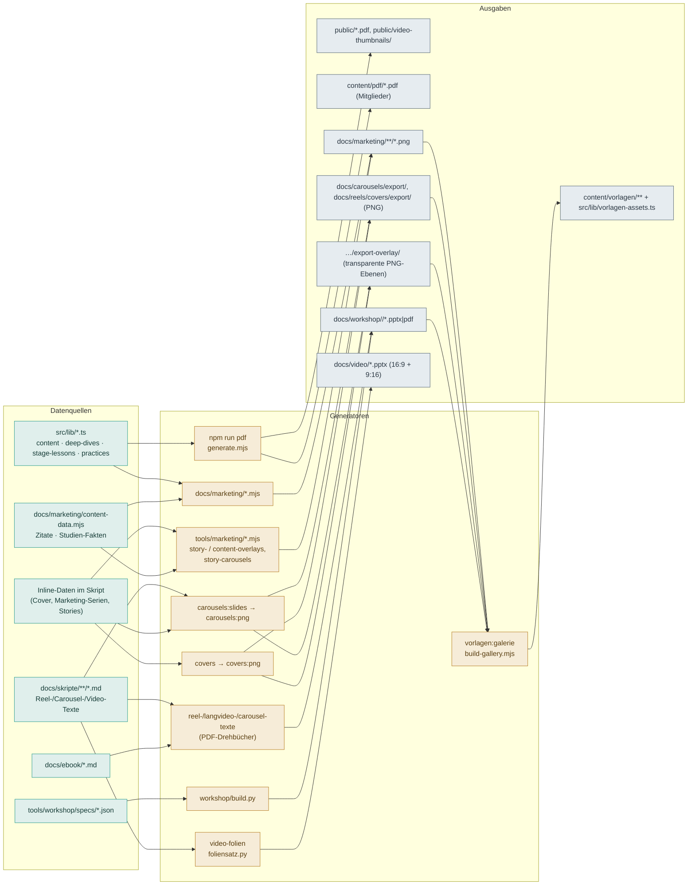
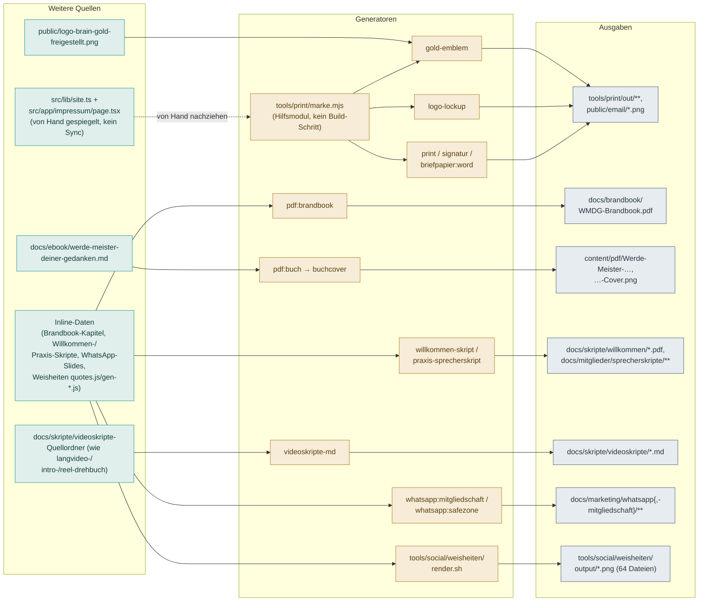

# Generator-Handbuch

Dieses Verzeichnis dokumentiert **alle Generatoren** des Projekts so, dass sie
ohne Vorwissen reproduzierbar sind: was jeder Generator liest (Datenzugriff),
was er tut, was er erzeugt und welche Komponenten miteinander verbunden sind.

Gepflegt vom **Generator-Team** (`.claude/agents/`): `generator-architekt`
(Koordination + diese Übersicht), `pdf-dokumentar`, `visual-dokumentar`,
`workshop-dokumentar`, `content-inventar`. Aufruf per `/generatoren-doku`.

## Detail-Dokumente

| Dokument | Inhalt |
|---|---|
| [`pdf-generatoren.md`](./pdf-generatoren.md) | E-Book- & Mitglieder-PDFs, Drehbücher (`tools/pdf/`) |
| [`visual-generatoren.md`](./visual-generatoren.md) | Carousels & Reels-Cover (`docs/carousels/`, `docs/reels/`) |
| [`marketing-und-galerie.md`](./marketing-und-galerie.md) | Marketing-Renderer (`docs/marketing/`), Overlay-Renderer (`tools/marketing/`), Vorlagen-Galerie (`tools/vorlagen/`) & Instagram-Weisheiten-Serie (`tools/social/weisheiten/`) |
| [`print-und-bildwerkzeuge.md`](./print-und-bildwerkzeuge.md) | Geschäftsausstattung (`tools/print/`: Visitenkarte, Briefpapier PDF+Word, E-Mail-Signatur, Logo-Zulieferer) & einmalige Bild-Freisteller (`tools/images/`) |
| [`workshop-generator.md`](./workshop-generator.md) | Workshop-PPTX/PDF (`tools/workshop/`) + Spec-Format |
| [`video-foliensatz.md`](./video-foliensatz.md) | Video-On-Screen-Folien im Creme-Branding (`tools/video/`) |
| [`content-inventar.md`](./content-inventar.md) | Vollständige Liste aller Inhalte + Zählungen |

---

## Datenfluss: Quelle → Generator → Ausgabe



Kernkette: Die **Vorlagen-Galerie** ist der Endverbraucher — sie sammelt die
Ausgaben der übrigen Generatoren (`docs/marketing/`, `docs/*/export/`,
`docs/workshop/`) ein und baut daraus `content/vorlagen/` + den Katalog
`src/lib/vorlagen-assets.ts` fürs Admin-Dashboard `/admin/vorlagen`.

### Nebenketten: Print, Buch/Brandbook, Sprecher-/Willkommen-Skripte, WhatsApp, Weisheiten

Diese Generatoren hängen **nicht** an der Vorlagen-Galerie (kein Treffer für
„print"/„brandbook"/„buch"/„whatsapp"/„weisheiten" in `build-gallery.mjs`) und
bilden eigene, kleinere Ketten:



Print-Kette ist strikt sequenziell: `marke.mjs` liefert Kontakt-/Farbdaten an
alle drei; `gold-emblem` **muss vor** `signatur` (lokale Vorschau) laufen,
`logo-lockup` **muss vor** `briefpapier:word` laufen (Pflicht-Datei, sonst
`ENOENT`). `print` selbst ist eigenständig (nutzt das Gold-Emblem-PNG direkt).

---

## Alle Generatoren auf einen Blick

| Generator | Aufruf | Liest | Schreibt |
|---|---|---|---|
| PDF-Pipeline | `npm run pdf` | `src/lib/{content,stage-lessons,deep-dives}.ts` + feste Texte | `public/…7-Stufen….pdf`, `content/pdf/*.pdf` |
| E-Book „Gedanken" | `python3 tools/pdf/build-ebook-gedanken.py` | `docs/ebook/die-gedanken….md` | `.build/ebook-gedanken.html` (PDF manuell) |
| Brandbook | `npm run pdf:brandbook` | Inline (Python-Literale je Kapitel); `public/logo-brain-gold.png`, `public/logo-full.png` | `docs/brandbook/WMDG-Brandbook.pdf` |
| Buch „Werde Meister…" | `npm run pdf:buch` | `docs/ebook/werde-meister-deiner-gedanken.md` (Default, Env `BUCH_MD`) + Assets | `content/pdf/Werde-Meister-deiner-Gedanken.pdf` |
| Buchcover (PNG) | `npm run buchcover` | `tools/pdf/.build/book-wmdg.html` (baut `build-buch.py` bei Bedarf selbst) | `content/pdf/Werde-Meister-deiner-Gedanken-Cover.png` |
| Reel-Drehbücher | `npm run reel-drehbuch` | `docs/skripte/reels/*.md` | `docs/workshop/reel-skripte/*.pdf` |
| Reel-Skripte „7 Stufen" (Arbeitsheft-Design) | `python3 tools/pdf/build-reel-skripte.py` (kein npm-Script) | `tools/pdf/assets/reel-source.html`, `assets/fonts.css`, `tools/workshop/assets/brain.png` | `docs/skripte/reels/reel-skripte-7-stufen.html` + `.build/…print.html` (PDF-Schritt manuell) |
| Carousel-Texte | `node tools/pdf/carousel-texte.mjs` | `docs/skripte/carousels/*.md` | `docs/workshop/carousel-texte/*.pdf` |
| Langvideo-Drehbücher | `npm run langvideo-drehbuch` | `docs/skripte/{stufen,…}/*.md` | `WMDG-Video-Drehbuch-*.pdf` (Repo-Root!) |
| Intro-Video | `node tools/pdf/intro-video-drehbuch.mjs` | `docs/skripte/landing/*.md` | `WMDG-Video-Drehbuch-Intro.pdf` |
| Willkommen-Skript (Dashboard-Video) | `npm run willkommen-skript [ausgabe-verzeichnis]` | Inline (JS-Literale); `docs/reels/covers/_fonts.css`, `public/logo-brain-gold.png` | `docs/skripte/willkommen/Willkommensvideo-Dashboard.pdf` |
| Praxis-Sprecherskript | `node tools/pdf/praxis-sprecherskript.mjs [ausgabe-verzeichnis]` (kein npm-Script) | `tools/pdf/praxis-skripte-data.mjs` (inline) | `docs/mitglieder/sprecherskripte/**` (13 Einzel-PDFs + Leitfaden + Gesamtmappe) |
| Videoskripte als Markdown | `npm run videoskripte-md [ausgabe-verzeichnis]` | dieselben Quell-Markdowns wie langvideo-/intro-/reel-drehbuch | `docs/skripte/videoskripte/*.md` |
| Carousel-Slides | `npm run carousels:slides` | `docs/skripte/carousels/*.md` (via `data.mjs`) | `docs/carousels/build/**` (HTML) |
| Carousel-PNG | `npm run carousels:png` | Carousel-HTMLs (baut selbst) | `docs/carousels/export/**` + `export-overlay/**` (PNG) |
| Marketing-Serien | `node docs/carousels/marketing-serien.mjs` | Inline | `docs/carousels/export/<serie>/**` |
| Stufen-Überblick | `node docs/carousels/stufen-ueberblick.mjs` | Inline | `docs/carousels/export/stufen-ueberblick/**` |
| Reel-Cover | `npm run covers` | `docs/reels/covers/data.mjs` | `docs/reels/covers/**` (HTML) |
| Reel-Cover-PNG | `npm run covers:png` | Cover-HTMLs (**Vorlauf nötig**) | `docs/reels/covers/export/**` + `export-overlay/**` (PNG) |
| Endcards | `npm run endcard` | Inline | `docs/reels/covers/endcard/*` (HTML) |
| Social-Banner | `node docs/marketing/social-banners.mjs` | Inline | `docs/marketing/**/*.png` |
| Profil-Avatar | `node docs/marketing/profile-avatar.mjs` | Inline | `docs/marketing/profil/*.png` — ⚠ zu klären: Skript fehlt im Repo (auch nicht in der Git-Historie), Ausgabe `docs/marketing/profil/*.png` **nicht reproduzierbar** |
| Brand-Assets | `SCALE=2 npm run brand-assets` (= `SCALE=2 node docs/marketing/brand-assets.mjs`) | Inline + `docs/marketing/content-data.mjs` | `docs/marketing/**/*.png` |
| Video-Thumbnails | `node docs/marketing/video-thumbnails.mjs` | `src/lib/{content,deep-dives,practices}.ts` | `public/video-thumbnails/**` |
| Story-Overlays | `npm run story-overlays` | Inline (`STORIES`) | `docs/marketing/story-overlays/**` |
| Content-Overlays | `npm run content-overlays` | `docs/marketing/content-data.mjs` | `docs/marketing/content-overlays/**` |
| Story-Carousels | `node tools/marketing/story-carousels.mjs` | Inline (`STORIES`) | `docs/marketing/story-carousels/**` |
| WhatsApp-Mitgliedschaft | `npm run whatsapp:mitgliedschaft` | Inline (`SLIDES`); `docs/reels/covers/_fonts.css`, `public/logo-brain-{gold,tuerkis}.png` | `docs/marketing/whatsapp-mitgliedschaft/{4x5,9x16,1x1,16x9}/**` |
| WhatsApp-Safezone | `npm run whatsapp:safezone` | Inline (feste Maße) | `docs/marketing/whatsapp/WMDG-WhatsApp-SafeZone-Vorlage.png` |
| Weisheiten-Serie A–F | `cd tools/social/weisheiten && ./render.sh` (kein npm-Script) | `quotes.js`, `assets.js`, `quellen/**`, inline Texte (Serien D–F) | `tools/social/weisheiten/output/*.png` (64 Dateien) |
| Marketing-Carousels (Galerie) | `node tools/vorlagen/marketing-carousels.mjs` | `docs/carousels/export/<key>/**` | `content/vorlagen/carousels/marketing__*` (**additiv**) |
| Stripe-Anleitung | `node tools/pdf/anleitung-stripe.mjs [zielordner]` | Inline | `docs/workshop/anleitungen/WMDG-Anleitung-Stripe-Mitgliedschaft.pdf` |
| Workshop | `python3 tools/workshop/build.py <spec>` | `tools/workshop/specs/*.json` | `docs/workshop/<slug>/*` + Spiegel |
| Video-Folien (Creme) | `npm run video-folien` | `docs/skripte/{stufen-komplett,praxis,vertiefungen-komplett,landing,reels}/*.md` | `docs/video/WMDG-Video-Folien*.pptx` (7 Decks: 16:9-Langvideo · Teaser-Reel · 5 Reel-Serien) |
| Vorlagen-Galerie | `npm run vorlagen:galerie` | `docs/{marketing,carousels,reels,workshop}/…` | `content/vorlagen/**` + `vorlagen-assets.ts` |
| Geschäftsausstattung (Visitenkarte + Briefpapier PDF) | `npm run print` | `tools/print/marke.mjs`, `tools/pdf/assets/fonts.css`, `public/logo-brain-gold-freigestellt.png` | `tools/print/out/WMDG-{Visitenkarte,Briefpapier}*.pdf` + Vorschau-PNGs |
| E-Mail-Signatur | `npm run signatur` | `tools/print/marke.mjs`; `public/email/wmdg-signatur-logo.png` (lokale Vorschau) | `tools/print/out/WMDG-Email-Signatur*.html/.txt` + Vorschau-PNGs |
| Briefpapier-Word | `npm run briefpapier:word` | `tools/print/marke.mjs`; `public/email/wmdg-logo-lockup.png` (**Pflicht**, kein `existsSync`-Guard) | `tools/print/out/WMDG-Briefpapier-Vorlage.docx` |
| Gold-Emblem | `npm run gold-emblem` | `public/logo-brain-gold-freigestellt.png` (**Pflicht**) | `public/email/wmdg-signatur-logo.png` |
| Logo-Lockup | `npm run logo-lockup` | `tools/print/marke.mjs` (`CONTACT.lockup`), `tools/pdf/assets/fonts.css`, `public/logo-brain-gold-freigestellt.png` | `public/email/wmdg-logo-lockup.png` |
| Eisvogel-Freisteller | `node tools/images/eisvogel-transparent.mjs [quelle] [ziel]` (kein npm-Script) | `tools/images/eisvogel-gold-source.png` (Default) | `public/eisvogel-gold.webp` |
| Schneeleopard-WebP | `node tools/images/schneeleopard-webp.mjs [quelle] [ziel]` (kein npm-Script) | `public/schneeleopard.png` (Default — ⚠ **fehlt im Repo**, bewusst entfernt) | `public/schneeleopard.webp` |

`tools/vorlagen/bild-jobs.mjs` und `tools/print/marke.mjs` sind **kein eigener
Generator**, sondern gemeinsame Hilfsmodule (reiner ES-Modul-Import ohne
eigenen `main()`/Shebang/npm-Script) — siehe
[`marketing-und-galerie.md`](./marketing-und-galerie.md#tools/vorlagen/bild-jobs.mjs--kein-eigener-generator-gemeinsames-hilfsmodul)
bzw.
[`print-und-bildwerkzeuge.md`](./print-und-bildwerkzeuge.md#toolsprintmarkemjs--kein-eigener-generator-gemeinsames-datenmodul).

**Ohne npm-Script** (nur direkt startbar): `build-ebook-gedanken.py`,
`carousel-texte.mjs`, `intro-video-drehbuch.mjs`, `anleitung-stripe.mjs`,
`marketing-serien.mjs`, `stufen-ueberblick.mjs`, `video-thumbnails.mjs`,
`story-carousels.mjs`, `marketing-carousels.mjs`, `build-reel-skripte.py`,
`praxis-sprecherskript.mjs`, `tools/social/weisheiten/render.sh`,
`tools/images/eisvogel-transparent.mjs`, `tools/images/schneeleopard-webp.mjs`
— sowie `docs/marketing/profile-avatar.mjs`, das zusätzlich **im Repo nicht
existiert** (⚠ zu klären, s. Zeile „Profil-Avatar" oben).

---

## Umgebung & Voraussetzungen

- **Node** (getestet v22) — alle `.mjs`-Generatoren. **Mindestens v20**, sobald
  Playwright im Spiel ist: `playwright@1.62` bricht sonst noch vor dem ersten
  Render mit „You are running Node.js 18.19.1. Playwright requires Node.js 20 or
  higher." ab. Auf dem Hetzner-Server steht der System-Node auf
  **v18.19.1** (`/usr/bin/node`, Ubuntu-Paket); daneben liegt ein
  eigenständiges **Node 22** unter `/opt/node22`. Generatoren dort also mit
  vollem Pfad starten:
  ```bash
  PLAYWRIGHT_BROWSERS_PATH=/opt/pw-browsers \
    /opt/node22/bin/node docs/carousels/marketing-serien.mjs
  ```
  Ein `node:22-bookworm`-Container ist **kein** Ersatz: dem Image fehlen die
  Chromium-Systembibliotheken (`libnss3`, `libatk-1.0`, `libgbm`, `libasound`
  u. a.), die der Host vollständig mitbringt.
- **Python 3** — `tools/pdf/*.py` und `tools/workshop/build.py`. Pakete:
  `python-pptx` + `Pillow` (Workshop); die E-Book/Member-Skripte nutzen nur
  die Standardbibliothek. Zusätzlich **PyMuPDF** (`pip install pymupdf`,
  Import als `pymupdf`, Fallback `import fitz as pymupdf` für ältere
  Versionen) für `tools/pdf/buchcover-png.py` (`npm run buchcover`) — rastert
  die gerenderte Cover-PDF-Seite zu PNG. Kein `requirements.txt` im Repo; Pakete
  müssen manuell installiert werden.
- **Chromium/Playwright** — für alle PNG- und PDF-Renderer. In dieser Umgebung
  **vorinstalliert** unter `/opt/pw-browsers`; `PLAYWRIGHT_SKIP_BROWSER_DOWNLOAD=1`.
  **Kein `playwright install` nötig.** Sonst: `npx playwright install chromium`
  oder `CHROME_BIN=/pfad/zu/chrome` setzen. **Ausnahme:** `tools/social/weisheiten/render.sh`
  nutzt **nicht** die dynamische `findChrome()`-Suche der übrigen Generatoren,
  sondern einen fest verdrahteten Default-Pfad
  `CHROME="${CHROME:-/opt/pw-browsers/chromium-1194/chrome-linux/chrome}"` — an
  eine konkrete Chromium-Build-Nummer gebunden, bricht mit „Chromium nicht
  gefunden" ab, sobald sich die installierte Version ändert (⚠ zu klären, s. u.);
  Workaround: `CHROME=/pfad/zu/chrome ./render.sh`.
- **npm-Pakete:** `pdf-lib` (Merge in `generate.mjs`), `playwright`, `typescript`
  (für `extract-content.mjs`), **`docx`** (devDependency `^9.7.1`, für
  `tools/print/briefpapier-word.mjs`) — alle in `package.json`.
- **`sharp`** — von `npm run vorlagen:galerie` direkt importiert und seit
  Kurzem auch **als direkte Dependency deklariert** (`^0.34.5`). Vorher war es
  nur transitiv über `next@16.2.10` auflösbar und dort als **optional**
  markiert — ein `npm ci --omit=optional` oder eine Plattform ohne passendes
  Prebuilt hätte es übersprungen und den Galerie-Build mit
  „Cannot find package 'sharp'" abbrechen lassen. `npm ls sharp` zeigt es jetzt
  auf oberster Ebene (mit `next` dedupliziert).
  Wird außerdem (unabhängig vom Galerie-Build) von `tools/print/gold-emblem.mjs`
  und beiden `tools/images/*.mjs`-Freistellern direkt importiert — reine
  Pixel-Operationen, **kein** Chromium/Playwright nötig.
- **System-Binaries:** `zip`/`unzip` (nur Galerie-Build).
- **Fehlende Quelldatei:** `tools/images/schneeleopard-webp.mjs` braucht als
  Default-Quelle `public/schneeleopard.png` — laut Kopfkommentar **bewusst
  entfernt**, um `public/` klein zu halten. Ohne dieses (nicht versionierte)
  Original-PNG ist `public/schneeleopard.webp` **nicht** aus dem Repo heraus
  reproduzierbar; im Bedarfsfall Original wieder als Quelle übergeben.
- **Env-Variablen** (aus `.env.local.example`) betreffen die Website-Runtime
  (Supabase, Resend, Stripe), **nicht** die Generatoren — diese laufen ohne
  gesetzte Secrets.

## Zwei Fallstricke beim Neubauen

**1. `SCALE=2` bei den Brand-Assets.** `brand-assets.mjs` rendert per
`deviceScaleFactor` und hat den Default `SCALE=1`. Die eingecheckten Grafiken
sind aber durchweg in **doppelter Auflösung** abgelegt (Zitate/Fakten/E-Book
z. B. 2160×2700 statt 1080×1350) – so gewollt seit „Marken-Assets in doppelter
Auflösung". Wer das Skript ohne den Schalter startet, **halbiert die Assets
stillschweigend**: es gibt keine Warnung, nur kleinere Dateien.

```bash
SCALE=2 node docs/marketing/brand-assets.mjs                # alle
SCALE=2 ONLY=ebook node docs/marketing/brand-assets.mjs     # Teilmenge
```

Betroffen sind nur `brand-assets.mjs`, `marketing-serien.mjs` und
`stufen-ueberblick.mjs` – die Story-Generatoren in `tools/marketing/` kennen
keinen `SCALE`-Schalter und rendern immer 1×.

**2. Sonderzeichen gehören nicht in gerendertes Markup.** Die eingebetteten
Schriften decken nur ein Latin-Subset ab. Ein Zeichen außerhalb davon holt sich
Chromium aus einer **Schrift des Betriebssystems** – dann rendert dieselbe
Codebasis auf zwei Rechnern verschiedene PNGs, und weil die fremde Glyphe die
Zeilenhöhe verändert, verrutscht zusätzlich die Zeile darunter.

Konkret fehlt `U+2192` (→) im Subset, obwohl `U+2191` (↑) und `U+2193` (↓)
enthalten sind. Deshalb liegt der Pfeil seit Kurzem als gezeichnetes Inline-SVG
in **`docs/_glyphs.mjs`**:

```js
import { ARROW } from "../_glyphs.mjs";
`<div class="cta">E-Book gratis sichern ${ARROW}</div>`
```

Wer neue Sonderzeichen in Bild-Markup aufnimmt, prüft vorher den
`unicode-range` in `tools/pdf/assets/fonts.css` bzw.
`docs/reels/covers/_fonts.css` – oder zeichnet das Zeichen ebenfalls.

---

## Reproduzierbarkeits-Reihenfolge (Vollbau der Galerie)

```bash
# 1. Rohtexte pflegen: docs/skripte/**, docs/ebook/**, tools/workshop/specs/**
# 2. Bild-Exporte erzeugen (Chromium)
npm run covers && npm run covers:png
npm run carousels:slides && npm run carousels:png
node docs/carousels/marketing-serien.mjs
node docs/marketing/social-banners.mjs
SCALE=2 node docs/marketing/brand-assets.mjs      # SCALE=2 ist Pflicht, s. u.
# 2b. Overlay-Vorlagen (transparente Ebenen für eigene Fotos in Canva)
npm run story-overlays && npm run content-overlays
node tools/marketing/story-carousels.mjs
# 3. Workshop-Materialien
python3 tools/workshop/build.py tools/workshop/specs/*.json
# 4. Galerie zusammenstellen (braucht sharp, zip/unzip) — destruktiv!
npm run vorlagen:galerie
# 5. Mitglieder-/Lead-PDFs
npm run pdf
```

> **Wichtig:** `docs/carousels/export/` existiert erst nach Schritt 2. Läuft
> `vorlagen:galerie` ohne diese Exporte, trägt es **still 0 Carousel-/Reel-
> Einträge** ein (kein Fehler, aber leere Galerie-Bereiche).

---

## Offene Punkte (⚠ zu klären) — gesammelt

Details stehen in den jeweiligen Detail-Dokumenten; hier nur die Übersicht,
damit nichts beim Querlesen verloren geht.

- **Profil-Avatar fehlt komplett.** `docs/marketing/profile-avatar.mjs`
  existiert weder im Arbeitsbaum noch in der Git-Historie, wird aber in diesem
  README (s. o.) **und** im Revier von `.claude/agents/visual-dokumentar.md`
  referenziert. `docs/marketing/profil/*.png` liegt zwar vor (laut
  `docs/AENDERUNGEN.md`), ist aber **nicht reproduzierbar** — unklar, ob
  Handarbeit, gelöschtes Skript oder Teil von `brand-assets.mjs`. Siehe
  [`marketing-und-galerie.md`](./marketing-und-galerie.md#docsmarketingprofile-avatarmjs--zu-klären-skript-fehlt-im-repo).
- **`build-reel-skripte.py` ist verwaist.** Kein npm-Script, keine Referenz in
  `package.json` oder einem anderen Orchestrator. Deckt denselben
  Themenbereich („Die 7 Stufen"-Reels) wie `reel-drehbuch.mjs` +
  `docs/skripte/reels/*.md` ab, aber mit anderem Quellformat (HTML statt
  Markdown) und anderem Design — unklar, ob noch aktiv gepflegt oder abgelöst.
- **Willkommen-/Praxis-Sprecherskript ohne technische Kopplung an ihre
  Quellen.** `willkommen-skript.mjs` behauptet laut Kopfkommentar 1:1 zu
  `docs/skripte/willkommen/dashboard-willkommen.md` zu sein, liest die Datei
  aber **nicht ein** (reine JS-Literale). `praxis-sprecherskript.mjs`
  verhält sich analog zu `src/lib/practices.ts` über
  `tools/pdf/praxis-skripte-data.mjs`. In beiden Fällen ist die
  Übereinstimmung **redaktionelle Konvention, keine erzwungene Kopplung** —
  Änderungen an der Quelle ziehen nicht automatisch ins PDF.
- **Brandbook-Texte sind eine Kopie.** `build-brandbook.py` hält alle Inhalte
  (Markenwerte, Farbwerte, 7-Stufen-Titel) als feste Python-Literale — auch
  wenn das PDF selbst `src/lib/site.ts`, `src/lib/content.ts` u. a. als
  „Quellen der Wahrheit" nennt, ist das nur Text im PDF, kein Lesezugriff.
  Kann von den tatsächlichen Marken-Quellen abweichen, ohne dass der Generator
  das erkennt.
- **Stripe-Anleitung ist eine Momentaufnahme.** `anleitung-stripe.mjs` hält
  Preise/Schritte/Env-Namen fest im Skript, ohne Abgleich gegen die
  tatsächliche Stripe-/Env-Konfiguration — bei Preisänderungen muss das PDF
  manuell nachgezogen werden.
- **`whatsapp-mitgliedschaft` nicht (vollständig) in der Galerie.**
  `build-gallery.mjs` hat keinen eigenen `buildWhatsapp…()`-Schritt; die
  fertigen Folien unter `docs/marketing/whatsapp-mitgliedschaft/<format>/*.png`
  **würden** technisch von `buildSocial()` mit erfasst (liegen unter
  `docs/marketing/**`), die `overlay/`-Unterordner dagegen nicht — ob das so
  gewollt ist, ist unklar.
- **`whatsapp-safezone` im Einsammelbereich von `buildSocial()`.** Die
  Planungsgrafik `docs/marketing/whatsapp/WMDG-WhatsApp-SafeZone-Vorlage.png`
  ist eine interne Hilfsgrafik (kein Kunden-Asset), liegt aber unter
  `docs/marketing/**/*.png` und würde von `buildSocial()` beim nächsten
  `vorlagen:galerie`-Lauf technisch mit in die Galerie aufgenommen — unklar,
  ob gewollt.
- **`render.sh`-Chromium-Pfad hart codiert.** Die Instagram-Weisheiten-Serie
  (`tools/social/weisheiten/render.sh`) sucht Chromium **nicht** dynamisch
  (anders als alle `.mjs`-Generatoren), sondern über einen fest verdrahteten
  Pfad mit Build-Nummer `/opt/pw-browsers/chromium-1194/chrome-linux/chrome` —
  bricht ab, sobald sich die installierte Chromium-Version ändert.
- **`briefpapier-word.mjs` ohne `existsSync`-Guard.** Liest
  `public/email/wmdg-logo-lockup.png` per `readFileSync` ohne vorherige
  Existenzprüfung — fehlt die Datei (weil `npm run logo-lockup` noch nicht
  lief), bricht der Build mit einem generischen `ENOENT` statt einer
  sprechenden Fehlermeldung ab.
- **`marke.mjs` von Hand gespiegelt.** `tools/print/marke.mjs` (`CONTACT`, `C`)
  ist laut Kommentar „gespiegelt aus `src/lib/site.ts` und
  `src/app/impressum/page.tsx`" — kein automatischer Sync, kein Check. Ändert
  sich Name/Anschrift/USt-IdNr. dort, driftet `marke.mjs` unbemerkt auseinander,
  bis jemand es manuell nachzieht.
- **`schneeleopard.png` fehlt im Repo.** Default-Quelle von
  `tools/images/schneeleopard-webp.mjs` wurde laut Kopfkommentar bewusst
  entfernt (`public/` klein halten) — `public/schneeleopard.webp` ist aktuell
  **nicht** aus dem Repo heraus neu erzeugbar, nur das fertige WebP ist
  committet.
