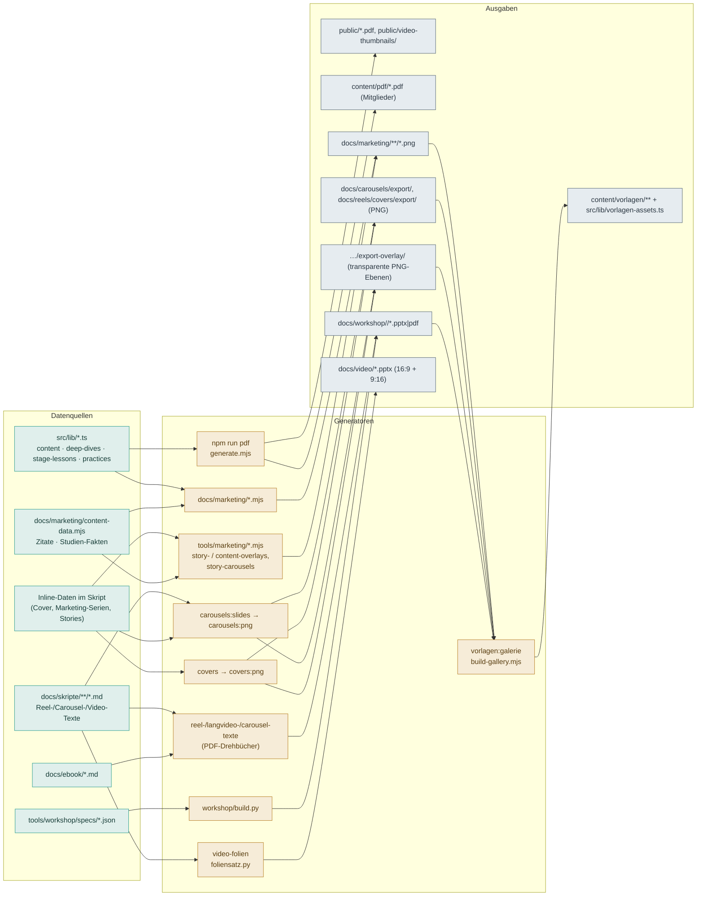

# Generator-Handbuch

Dieses Verzeichnis dokumentiert **alle Generatoren** des Projekts so, dass sie
ohne Vorwissen reproduzierbar sind: was jeder Generator liest (Datenzugriff),
was er tut, was er erzeugt und welche Komponenten miteinander verbunden sind.

Gepflegt vom **Generator-Team** (`.claude/agents/`): `generator-architekt`
(Koordination + diese Übersicht), `pdf-dokumentar`, `visual-dokumentar`,
`workshop-dokumentar`, `content-inventar`. Aufruf per `/generatoren-doku`.

## Detail-Dokumente

| Dokument | Inhalt |
|---|---|
| [`pdf-generatoren.md`](./pdf-generatoren.md) | E-Book- & Mitglieder-PDFs, Drehbücher (`tools/pdf/`) |
| [`visual-generatoren.md`](./visual-generatoren.md) | Carousels & Reels-Cover (`docs/carousels/`, `docs/reels/`) |
| [`marketing-und-galerie.md`](./marketing-und-galerie.md) | Marketing-Renderer (`docs/marketing/`) & Vorlagen-Galerie (`tools/vorlagen/`) |
| [`workshop-generator.md`](./workshop-generator.md) | Workshop-PPTX/PDF (`tools/workshop/`) + Spec-Format |
| [`video-foliensatz.md`](./video-foliensatz.md) | Video-On-Screen-Folien im Creme-Branding (`tools/video/`) |
| [`content-inventar.md`](./content-inventar.md) | Vollständige Liste aller Inhalte + Zählungen |

---

## Datenfluss: Quelle → Generator → Ausgabe



Kernkette: Die **Vorlagen-Galerie** ist der Endverbraucher — sie sammelt die
Ausgaben der übrigen Generatoren (`docs/marketing/`, `docs/*/export/`,
`docs/workshop/`) ein und baut daraus `content/vorlagen/` + den Katalog
`src/lib/vorlagen-assets.ts` fürs Admin-Dashboard `/admin/vorlagen`.

---

## Alle Generatoren auf einen Blick

| Generator | Aufruf | Liest | Schreibt |
|---|---|---|---|
| PDF-Pipeline | `npm run pdf` | `src/lib/{content,stage-lessons,deep-dives}.ts` + feste Texte | `public/…7-Stufen….pdf`, `content/pdf/*.pdf` |
| E-Book „Gedanken" | `python3 tools/pdf/build-ebook-gedanken.py` | `docs/ebook/die-gedanken….md` | `.build/ebook-gedanken.html` (PDF manuell) |
| Reel-Drehbücher | `npm run reel-drehbuch` | `docs/skripte/reels/*.md` | `docs/workshop/reel-skripte/*.pdf` |
| Carousel-Texte | `node tools/pdf/carousel-texte.mjs` | `docs/skripte/carousels/*.md` | `docs/workshop/carousel-texte/*.pdf` |
| Langvideo-Drehbücher | `npm run langvideo-drehbuch` | `docs/skripte/{stufen,…}/*.md` | `WMDG-Video-Drehbuch-*.pdf` (Repo-Root!) |
| Intro-Video | `node tools/pdf/intro-video-drehbuch.mjs` | `docs/skripte/landing/*.md` | `WMDG-Video-Drehbuch-Intro.pdf` |
| Carousel-Slides | `npm run carousels:slides` | `docs/skripte/carousels/*.md` (via `data.mjs`) | `docs/carousels/build/**` (HTML) |
| Carousel-PNG | `npm run carousels:png` | Carousel-HTMLs (baut selbst) | `docs/carousels/export/**` + `export-overlay/**` (PNG) |
| Marketing-Serien | `node docs/carousels/marketing-serien.mjs` | Inline | `docs/carousels/export/<serie>/**` |
| Stufen-Überblick | `node docs/carousels/stufen-ueberblick.mjs` | Inline | `docs/carousels/export/stufen-ueberblick/**` |
| Reel-Cover | `npm run covers` | `docs/reels/covers/data.mjs` | `docs/reels/covers/**` (HTML) |
| Reel-Cover-PNG | `npm run covers:png` | Cover-HTMLs (**Vorlauf nötig**) | `docs/reels/covers/export/**` + `export-overlay/**` (PNG) |
| Endcards | `npm run endcard` | Inline | `docs/reels/covers/endcard/*` (HTML) |
| Social-Banner | `node docs/marketing/social-banners.mjs` | Inline | `docs/marketing/**/*.png` |
| Profil-Avatar | `node docs/marketing/profile-avatar.mjs` | Inline | `docs/marketing/profil/*.png` |
| Brand-Assets | `SCALE=2 node docs/marketing/brand-assets.mjs` | Inline + `docs/marketing/content-data.mjs` | `docs/marketing/**/*.png` |
| Video-Thumbnails | `node docs/marketing/video-thumbnails.mjs` | `src/lib/{content,deep-dives,practices}.ts` | `public/video-thumbnails/**` |
| Story-Overlays | `npm run story-overlays` | Inline (`STORIES`) | `docs/marketing/story-overlays/**` |
| Content-Overlays | `npm run content-overlays` | `docs/marketing/content-data.mjs` | `docs/marketing/content-overlays/**` |
| Story-Carousels | `node tools/marketing/story-carousels.mjs` | Inline (`STORIES`) | `docs/marketing/story-carousels/**` |
| Marketing-Carousels (Galerie) | `node tools/vorlagen/marketing-carousels.mjs` | `docs/carousels/export/<key>/**` | `content/vorlagen/carousels/marketing__*` (**additiv**) |
| Stripe-Anleitung | `node tools/pdf/anleitung-stripe.mjs [zielordner]` | Inline | `docs/workshop/anleitungen/WMDG-Anleitung-Stripe-Mitgliedschaft.pdf` |
| Workshop | `python3 tools/workshop/build.py <spec>` | `tools/workshop/specs/*.json` | `docs/workshop/<slug>/*` + Spiegel |
| Video-Folien (Creme) | `npm run video-folien` | `docs/skripte/{stufen-komplett,praxis,vertiefungen-komplett,landing,reels}/*.md` | `docs/video/WMDG-Video-Folien*.pptx` (7 Decks: 16:9-Langvideo · Teaser-Reel · 5 Reel-Serien) |
| Vorlagen-Galerie | `npm run vorlagen:galerie` | `docs/{marketing,carousels,reels,workshop}/…` | `content/vorlagen/**` + `vorlagen-assets.ts` |

**Ohne npm-Script** (nur direkt startbar): `build-ebook-gedanken.py`,
`carousel-texte.mjs`, `intro-video-drehbuch.mjs`, `anleitung-stripe.mjs`,
`marketing-serien.mjs`, `stufen-ueberblick.mjs`, `profile-avatar.mjs`,
`social-banners.mjs`, `brand-assets.mjs`, `video-thumbnails.mjs`,
`story-carousels.mjs`, `marketing-carousels.mjs`.

---

## Umgebung & Voraussetzungen

- **Node** (getestet v22) — alle `.mjs`-Generatoren. **Mindestens v20**, sobald
  Playwright im Spiel ist: `playwright@1.62` bricht sonst noch vor dem ersten
  Render mit „You are running Node.js 18.19.1. Playwright requires Node.js 20 or
  higher." ab. Auf dem Hetzner-Server steht der System-Node auf
  **v18.19.1** (`/usr/bin/node`, Ubuntu-Paket); daneben liegt ein
  eigenständiges **Node 22** unter `/opt/node22`. Generatoren dort also mit
  vollem Pfad starten:
  ```bash
  PLAYWRIGHT_BROWSERS_PATH=/opt/pw-browsers \
    /opt/node22/bin/node docs/carousels/marketing-serien.mjs
  ```
  Ein `node:22-bookworm`-Container ist **kein** Ersatz: dem Image fehlen die
  Chromium-Systembibliotheken (`libnss3`, `libatk-1.0`, `libgbm`, `libasound`
  u. a.), die der Host vollständig mitbringt.
- **Python 3** — `tools/pdf/*.py` und `tools/workshop/build.py`. Pakete:
  `python-pptx` + `Pillow` (Workshop); die E-Book/Member-Skripte nutzen nur
  die Standardbibliothek.
- **Chromium/Playwright** — für alle PNG- und PDF-Renderer. In dieser Umgebung
  **vorinstalliert** unter `/opt/pw-browsers`; `PLAYWRIGHT_SKIP_BROWSER_DOWNLOAD=1`.
  **Kein `playwright install` nötig.** Sonst: `npx playwright install chromium`
  oder `CHROME_BIN=/pfad/zu/chrome` setzen.
- **npm-Pakete:** `pdf-lib` (Merge in `generate.mjs`), `playwright`, `typescript`
  (für `extract-content.mjs`) — alle in `package.json`.
- **`sharp`** — von `npm run vorlagen:galerie` direkt importiert und seit
  Kurzem auch **als direkte Dependency deklariert** (`^0.34.5`). Vorher war es
  nur transitiv über `next@16.2.10` auflösbar und dort als **optional**
  markiert — ein `npm ci --omit=optional` oder eine Plattform ohne passendes
  Prebuilt hätte es übersprungen und den Galerie-Build mit
  „Cannot find package 'sharp'" abbrechen lassen. `npm ls sharp` zeigt es jetzt
  auf oberster Ebene (mit `next` dedupliziert).
- **System-Binaries:** `zip`/`unzip` (nur Galerie-Build).
- **Env-Variablen** (aus `.env.local.example`) betreffen die Website-Runtime
  (Supabase, Resend, Stripe), **nicht** die Generatoren — diese laufen ohne
  gesetzte Secrets.

## Zwei Fallstricke beim Neubauen

**1. `SCALE=2` bei den Brand-Assets.** `brand-assets.mjs` rendert per
`deviceScaleFactor` und hat den Default `SCALE=1`. Die eingecheckten Grafiken
sind aber durchweg in **doppelter Auflösung** abgelegt (Zitate/Fakten/E-Book
z. B. 2160×2700 statt 1080×1350) – so gewollt seit „Marken-Assets in doppelter
Auflösung". Wer das Skript ohne den Schalter startet, **halbiert die Assets
stillschweigend**: es gibt keine Warnung, nur kleinere Dateien.

```bash
SCALE=2 node docs/marketing/brand-assets.mjs                # alle
SCALE=2 ONLY=ebook node docs/marketing/brand-assets.mjs     # Teilmenge
```

Betroffen sind nur `brand-assets.mjs`, `marketing-serien.mjs` und
`stufen-ueberblick.mjs` – die Story-Generatoren in `tools/marketing/` kennen
keinen `SCALE`-Schalter und rendern immer 1×.

**2. Sonderzeichen gehören nicht in gerendertes Markup.** Die eingebetteten
Schriften decken nur ein Latin-Subset ab. Ein Zeichen außerhalb davon holt sich
Chromium aus einer **Schrift des Betriebssystems** – dann rendert dieselbe
Codebasis auf zwei Rechnern verschiedene PNGs, und weil die fremde Glyphe die
Zeilenhöhe verändert, verrutscht zusätzlich die Zeile darunter.

Konkret fehlt `U+2192` (→) im Subset, obwohl `U+2191` (↑) und `U+2193` (↓)
enthalten sind. Deshalb liegt der Pfeil seit Kurzem als gezeichnetes Inline-SVG
in **`docs/_glyphs.mjs`**:

```js
import { ARROW } from "../_glyphs.mjs";
`<div class="cta">E-Book gratis sichern ${ARROW}</div>`
```

Wer neue Sonderzeichen in Bild-Markup aufnimmt, prüft vorher den
`unicode-range` in `tools/pdf/assets/fonts.css` bzw.
`docs/reels/covers/_fonts.css` – oder zeichnet das Zeichen ebenfalls.

---

## Reproduzierbarkeits-Reihenfolge (Vollbau der Galerie)

```bash
# 1. Rohtexte pflegen: docs/skripte/**, docs/ebook/**, tools/workshop/specs/**
# 2. Bild-Exporte erzeugen (Chromium)
npm run covers && npm run covers:png
npm run carousels:slides && npm run carousels:png
node docs/carousels/marketing-serien.mjs
node docs/marketing/social-banners.mjs
SCALE=2 node docs/marketing/brand-assets.mjs      # SCALE=2 ist Pflicht, s. u.
# 2b. Overlay-Vorlagen (transparente Ebenen für eigene Fotos in Canva)
npm run story-overlays && npm run content-overlays
node tools/marketing/story-carousels.mjs
# 3. Workshop-Materialien
python3 tools/workshop/build.py tools/workshop/specs/*.json
# 4. Galerie zusammenstellen (braucht sharp, zip/unzip) — destruktiv!
npm run vorlagen:galerie
# 5. Mitglieder-/Lead-PDFs
npm run pdf
```

> **Wichtig:** `docs/carousels/export/` existiert erst nach Schritt 2. Läuft
> `vorlagen:galerie` ohne diese Exporte, trägt es **still 0 Carousel-/Reel-
> Einträge** ein (kein Fehler, aber leere Galerie-Bereiche).
