# Projektstruktur – Werde Meister deiner Gedanken

Vollständige Übersicht aller Seiten, Routen und Downloads des Projekts – mit
Verlinkung, Kurzbeschreibung und Strukturgramm. Technischer Unterbau:
**Next.js (App Router)** · **Supabase** (Auth/DB) · **Resend** (Mail) ·
**Tailwind**.

Zusammengetragen aus `src/app/**` sowie den datengetriebenen Inhalts-Modulen
`src/lib/{site,blog,content,deep-dives,practices}.ts`.

**Umfang:** 11 öffentliche Seiten · Login-geschützter Mitgliederbereich ·
7 API-/System-Routen · 7 Stufen · 13 Vertiefungen · 13 Praxis-Einheiten ·
17 Blog-Artikel.

---

## Strukturgramm

```mermaid
flowchart TB
  root(["/ Startseite"]):::pub

  root --> PUB[Öffentlich]:::grp
  root --> MEM[/mitglieder · Login/]:::grpm
  root --> SYS[API & System]:::grps

  PUB --> p1["/die-7-stufen"]:::pub
  PUB --> p2["/bewusstseinstest"]:::pub
  PUB --> p3["/ueber-mich"]:::pub
  PUB --> p4["/blog<br/>+ /blog/[slug] · 17"]:::pub
  PUB --> p5["/kontakt"]:::pub
  PUB --> p6["/ebook ⬇ PDF"]:::pub
  PUB --> p7["/login"]:::pub
  PUB --> p8["/impressum<br/>/datenschutz"]:::pub

  MEM --> m0["/mitglieder<br/>Dashboard"]:::mem
  MEM --> m1["/journal"]:::mem
  MEM --> m2["/stufe/[nr] · 1–7"]:::mem
  MEM --> m3["/wissen/[slug] · 13<br/>Vertiefungen"]:::mem
  MEM --> m4["/praxis/[slug] · 13"]:::mem
  MEM --> m5["/arbeitsheft ⬇"]:::mem
  MEM --> m6["/admin<br/>Cockpit"]:::mem

  m2 --> m2a["/lektion ⬇<br/>/uebungen ⬇"]:::pdf
  m3 --> m3a["/lektion ⬇"]:::pdf

  SYS --> s1["/api/kontakt"]:::sys
  SYS --> s2["/api/impulses<br/>(+ unsubscribe)"]:::sys
  SYS --> s3["/api/ebook<br/>confirm · unsubscribe"]:::sys
  SYS --> s4["/auth/callback"]:::sys
  SYS --> s5["sitemap.xml<br/>robots.txt"]:::sys

  classDef pub fill:#e0efec,stroke:#2f9e8f,color:#173d38;
  classDef mem fill:#f6ecd8,stroke:#b9822b,color:#5a3f11;
  classDef sys fill:#e6ecf0,stroke:#5b6b7a,color:#2b3742;
  classDef pdf fill:#f1efe8,stroke:#b7b0a0,color:#4a463c;
  classDef grp fill:#2f9e8f,stroke:#2f9e8f,color:#ffffff;
  classDef grpm fill:#b9822b,stroke:#b9822b,color:#ffffff;
  classDef grps fill:#5b6b7a,stroke:#5b6b7a,color:#ffffff;
```

---

## 1. Öffentliche Seiten

Frei zugänglich. Verlinkt in der Hauptnavigation (`mainNav`) bzw. im Footer
(`legalNav`) – definiert in `src/lib/site.ts`. In der `sitemap.xml` gelistet,
sofern nicht als *noindex* markiert.

| Route | Datei | Beschreibung |
|---|---|---|
| `/` | `app/page.tsx` | Startseite: Hero, 7 Stufen, Kompass, Angebot (`#angebot`), „Warum ich", Ablauf, Testimonials, Lead-Magnet, FAQ, Final-CTA |
| `/die-7-stufen` | `app/die-7-stufen/page.tsx` | Übersichtsseite zum Kernmodell – von Autopilot bis Meisterschaft |
| `/bewusstseinstest` | `app/bewusstseinstest/page.tsx` | 21 Fragen (~5 Min); ermittelt die persönliche Startstufe (fließt ins Mitglieder-Dashboard) |
| `/ueber-mich` | `app/ueber-mich/page.tsx` | Werdegang von Heiko Schwaninger |
| `/blog` | `app/blog/page.tsx` | Blog-Übersicht |
| `/blog/[slug]` | `app/blog/[slug]/page.tsx` | Einzelartikel (17 Beiträge) mit OpenGraph-Metadaten, aus `lib/blog.ts` |
| `/kontakt` | `app/kontakt/page.tsx` | Kontaktformular (Honeypot + Rate-Limit) → sendet über `/api/kontakt` |
| `/ebook` | `app/ebook/route.ts` | Route-Handler: liefert das Lead-Magnet-PDF „Die 7 Stufen kompakt" als Download |
| `/login` | `app/login/page.tsx` | Supabase-Anmeldung; leitet nach Login zu `/mitglieder` *(noindex)* |
| `/impressum` | `app/impressum/page.tsx` | Rechtliche Angaben (Footer) *(noindex)* |
| `/datenschutz` | `app/datenschutz/page.tsx` | DSGVO-Hinweise (Footer) *(noindex)* |

**Hauptnavigation:** Die 7 Stufen · Bewusstseinstest · Über mich · Angebot
(`/#angebot`) · Blog · Kontakt — plus „Mitglieder" und CTA „Kostenloses
Erstgespräch" (→ `/kontakt`).

---

## 2. Mitgliederbereich

Login-geschützt in doppelter Absicherung (Defense-in-Depth): zentral über
`src/proxy.ts` (Middleware) und zusätzlich im `mitglieder/layout.tsx`. Alle
Seiten sind *noindex* und in `robots.txt` gesperrt.

| Route | Datei | Beschreibung |
|---|---|---|
| `/mitglieder` | `app/mitglieder/page.tsx` | Dashboard/Hub: Fortschritt durch die 7 Stufen, empfohlene Startstufe (aus dem Test), aktuelle Meditation, Newsletter-Opt-in, Bibliothek |
| `/mitglieder/journal` | `app/mitglieder/journal/page.tsx` | Persönliches Journal / Reflexionen |
| `/mitglieder/stufe/[nr]` | `app/mitglieder/stufe/[nr]/page.tsx` | Stufen-Detail (1–7) mit verknüpften Vertiefungen, Praxis & Vor/Zurück-Navigation |
| `/mitglieder/stufe/[nr]/lektion` | `.../lektion/route.ts` | Komplette Lektion einer Stufe als gestaltetes PDF |
| `/mitglieder/stufe/[nr]/uebungen` | `.../uebungen/route.ts` | Übungs-Arbeitsblatt (mit Ausfüll-Linien) als PDF |
| `/mitglieder/wissen/[slug]` | `app/mitglieder/wissen/[slug]/page.tsx` | Vertiefungen (13) – psychologische Wissens-Bibliothek, je mit Übungen & Reflexionsfragen |
| `/mitglieder/wissen/[slug]/lektion` | `.../lektion/route.ts` | Vertiefung als gestaltetes PDF |
| `/mitglieder/praxis/[slug]` | `app/mitglieder/praxis/[slug]/page.tsx` | Praxis (13) – Meditationen, Atemübungen & Rituale mit Schritt-für-Schritt-Anleitung |
| `/mitglieder/arbeitsheft` | `.../arbeitsheft/route.ts` | Gesamt-Arbeitsheft über alle 7 Stufen als PDF |
| `/admin` | `app/admin/page.tsx` | Marketing-Cockpit: Funnel-Statistiken & Content-Inventar (nur Admin-E-Mails) *(noindex)* |

### Die 7 Stufen (`/mitglieder/stufe/1–7`)

| Nr | Titel | Untertitel |
|---|---|---|
| 01 | Autopilot | Du wirst gelebt |
| 02 | Erwachen | Du bemerkst es |
| 03 | Selbstbeobachtung | Du siehst dir zu |
| 04 | Emotionale Reifung | Du lässt los |
| 05 | Schöpferkraft | Du erschaffst bewusst |
| 06 | Innere Ausrichtung | Kopf, Herz und Handeln |
| 07 | Meisterschaft | Du gestaltest |

### Vertiefungen (`/mitglieder/wissen/[slug]`, 13)

- **Denken & Wahrnehmung:** Automatische Gedanken (`automatische-gedanken`) · Kognitive Verzerrungen (`kognitive-verzerrungen`) · Die Reiz-Reaktions-Lücke (`reiz-reaktions-luecke`) · Grübeln & Gedankenkreisen (`gruebeln`)
- **Prägung & Lernen:** Konditionierung (`konditionierung`) · Kernüberzeugungen (`kernueberzeugungen`)
- **Selbstbild:** Der innere Kritiker (`innerer-kritiker`) · Selbstmitgefühl (`selbstmitgefuehl`)
- **Gehirn:** Neuroplastizität (`neuroplastizitaet`)
- **Emotion:** Emotionsregulation (`emotionsregulation`)
- **Ausrichtung:** Werte & Ziele (`werte-und-ziele`) · Integration & Weitergabe (`integration-und-weitergabe`)
- **Körper & Gesundheit:** Muster, Körper & Gesundheit (`muster-und-koerper`)

### Praxis (`/mitglieder/praxis/[slug]`, 13)

- **Meditationen:** Atembeobachtung (5–10 Min) · Der innere Beobachter (10 Min) · Body-Scan (15 Min) · Herz-Kohärenz (5–10 Min)
- **Atemübungen:** Verlängertes Ausatmen (3–5 Min) · 4-6-Atmung (3 Min) · Box Breathing (3–5 Min)
- **Rituale:** Der Autopilot-Check (2 Min) · Morgen-Ausrichtung (5 Min) · Abend-Reflexion (5–10 Min) · Loslass-Ritual (15 Min) · Präsenz-Spaziergang (10–20 Min) · Die tägliche Rückkehr (5 Min)

---

## 3. API & System

Route-Handler ohne UI. `/api` ist vom Login-Proxy ausgenommen und daher
einzeln abgesichert (Rate-Limit, `CRON_SECRET`, Double-Opt-in). Mailversand
über Resend, Datenhaltung in Supabase.

| Route | Datei | Beschreibung |
|---|---|---|
| `/api/kontakt` | `app/api/kontakt/route.ts` | Nimmt das Kontaktformular entgegen, versendet per Resend inkl. Auto-Antwort; Rate-Limit pro IP |
| `/api/impulses` | `app/api/impulses/route.ts` | Serienversand der wöchentlichen E-Mail-Impulse an Opt-in-Profile (per Cron + `CRON_SECRET`) |
| `/api/impulses/unsubscribe` | `.../unsubscribe/route.ts` | Ein-Klick-Abmeldung von den Impulsen |
| `/api/ebook` | `app/api/ebook/route.ts` | E-Book-Lead-Erfassung mit Double-Opt-in (Bestätigungsmail → Klick liefert das E-Book) |
| `/api/ebook/confirm` | `.../confirm/route.ts` | Bestätigt die Einwilligung und stellt das E-Book zu |
| `/api/ebook/unsubscribe` | `.../unsubscribe/route.ts` | Abmeldung vom E-Book-Verteiler |
| `/auth/callback` | `app/auth/callback/route.ts` | Supabase Auth-Callback: verarbeitet den Mail-Link, setzt die Session, leitet zu `/mitglieder` |
| `/sitemap.xml` | `app/sitemap.ts` | Dynamisch: öffentliche Seiten + Blog-Artikel |
| `/robots.txt` | `app/robots.ts` | Sperrt `/mitglieder`, `/login`, `/impressum`, `/datenschutz`; verweist auf die Sitemap |

---

## Datenquellen der Inhalte

| Modul | Inhalt |
|---|---|
| `src/lib/site.ts` | Seiten-Config, Navigation (`mainNav`, `legalNav`), Social-Links |
| `src/lib/content.ts` | Die 7 Stufen, Werte, Features |
| `src/lib/deep-dives.ts` | 13 Vertiefungen (Wissens-Bibliothek) |
| `src/lib/practices.ts` | 13 Praxis-Einheiten (Meditation, Atem, Rituale) |
| `src/lib/blog.ts` | 17 Blog-Artikel |
| `src/lib/consciousness-test.ts` | Fragen des Bewusstseinstests |
| `src/lib/impulses.ts` | Texte der wöchentlichen E-Mail-Impulse |
